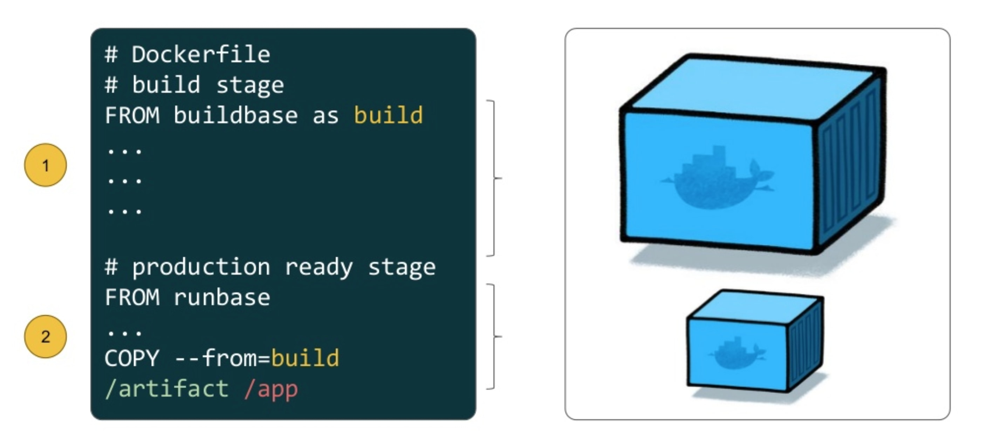

.. include:: ../substitutions.txt

Multi-stage builds
==================

Multi-stage builds (introduced in Docker version 17.06 CE) allow users to create Dockerfiles that contain
multiple build stages. With this in place, you can then copy build artifacts from one stage to
another while leaving behind all the dependencies that were required to perform the build. This is
another tool used to build more optimized Docker images. Each stage in the build is started with
a ``FROM`` statement in the Dockerfile.

  Multiple stages of a Dockerfile

Prerequisites
-------------

- Mac

  - `Docker Desktop for Mac <https://docs.docker.com/desktop/install/mac-install/>`_

- Windows

  - `Docker Desktop for Windows <https://docs.docker.com/desktop/install/windows-install/>`_
- Linux

  - `Docker Engine <https://docs.docker.com/engine/install/>`_

A simple example
----------------

Let's create a very simple `Go <https://go.dev/>`_ application:

.. code-block:: console

  $ cd ~/
  $ mkdir hellogo/
  $ cd hellogo/
  $ touch Dockerfile
  $ pwd
  /Users/username/hellogo/
  $ ls
  Dockerfile

Now, grab a copy of the Go source code that we want to containerize:

.. code-block:: golang

  package main

  import (
      "fmt"
      "os/user"
  )

  func main () {
      user, err := user.Current()
      if err != nil {
          panic(err)
      }

      fmt.Println("Hello, " + user.Username + "!")
  }

You can cut and paste the code block above into a new file called,
``app.go``, or download it from the following link: 

|appgourl|_

Now, you should have two files and nothing else in this folder:

.. code-block:: console

   $ pwd
   /Users/username/hellogo/
   $ ls
   Dockerfile  app.go

Edit the Dockerfile and enter the following:

.. code-block:: dockerfile

  FROM golang:1.21
  WORKDIR /src

  COPY app.go .

  RUN CGO_ENABLED=0 go build -o /usr/local/bin/hello ./app.go

  CMD [ "/usr/local/bin/hello" ]

We're going to base our image on the official Go image
(based on `Debian Bookworm <https://www.debian.org/releases/bookworm/>`_) and specify a tagged
version (1.21). Then, we're going to simply copy in the Go source code (``app.go``) and compile it to an
executable called ``hello``. Running this executable will also be our default command. Next, we'll create
a Docker image and run a container from that image:

.. code-block:: console

  $ docker build -t <username>/hellogo:0.0.1 .
  [+] Building 5.7s (8/8) FINISHED                                                                                  docker:desktop-linux
   => [internal] load build definition from Dockerfile                                                                              0.1s
   => => transferring dockerfile: 162B                                                                                              0.1s
   => [internal] load .dockerignore                                                                                                 0.1s
   => => transferring context: 2B                                                                                                   0.0s
   => [internal] load metadata for docker.io/library/golang:1.21                                                                    0.0s
   => [internal] load build context                                                                                                 0.0s
   => => transferring context: 28B                                                                                                  0.0s
   => CACHED [1/3] FROM docker.io/library/golang:1.21                                                                               0.0s
   => [2/3] COPY app.go .                                                                                                           0.2s
   => [3/3] RUN CGO_ENABLED=0 go build -o /usr/local/bin/hello ./app.go                                                             5.0s
   => exporting to image                                                                                                            0.2s
   => => exporting layers                                                                                                           0.2s
   => => writing image sha256:d7ba5612bc490f5645eda701b179ce2ecce4f51280bae66db7e5ea7ccbf2a79d                                      0.0s
   => => naming to docker.io/eriksf/hellogo:0.0.1
  $ docker run --rm <username>/hellogo:0.0.1
  Hello, root!

Let's take a look at the size of our image:

.. code-block:: console

  $ docker images <username>/hellogo
  REPOSITORY       TAG       IMAGE ID       CREATED             SIZE
  eriksf/hellogo   0.0.1     d7ba5612bc49   3 minutes ago       851MB

OK, let's see if we can reduce the size of our image by using multiple stages. Create a new
Dockerfile named ``Dockerfile.ms``.

.. code-block:: console

  $ touch Dockerfile.ms
  $ pwd
  /Users/username/hellogo/
  $ ls
  Dockerfile  Dockerfile.ms  app.go

Edit ``Dockerfile.ms`` and enter the following:

.. code-block:: dockerfile

  FROM golang:1.21 as build
  WORKDIR /src

  COPY app.go .

  RUN CGO_ENABLED=0 go build -o /usr/local/bin/hello ./app.go

  FROM alpine:3.18.3

  COPY --from=build /usr/local/bin/hello /usr/local/bin/hello

  CMD [ "/usr/local/bin/hello" ]

We've now got a Dockerfile with two build stages (starting with the ``FROM`` statements). The first stage grabs
an image with all the Go tools installed, copies in our source code, and compiles it to an executable. In the
second stage, we start with an `Alpine linux <https://www.alpinelinux.org/>`_ image (small, simple, and lightweight
Linux distribution) and then just copy in the executable from the build stage while jettisoning all the Go tools.

.. note::

  Note that we named our build stage, ``FROM golang:1.21 as build``. This makes it easier to read and
  identify the stage when copying from it.

Now, we'll create a new Docker image and run a container from that new image:

.. code-block:: console

  $ docker build -t <username>/hellogo:0.0.2 -f Dockerfile.ms .
  [+] Building 6.7s (13/13) FINISHED                                                                                docker:desktop-linux
   => [internal] load build definition from Dockerfile.ms                                                                           0.1s
   => => transferring dockerfile: 270B                                                                                              0.0s
   => [internal] load .dockerignore                                                                                                 0.1s
   => => transferring context: 2B                                                                                                   0.0s
   => [internal] load metadata for docker.io/library/alpine:3.18.3                                                                  1.2s
   => [internal] load metadata for docker.io/library/golang:1.21                                                                    0.0s
   => [auth] library/alpine:pull token for registry-1.docker.io                                                                     0.0s
   => [build 1/4] FROM docker.io/library/golang:1.21                                                                                0.0s
   => CACHED [stage-1 1/2] FROM docker.io/library/alpine:3.18.3@sha256:7144f7bab3d4c2648d7e59409f15ec52a18006a128c733fcff20d3a4a54  0.0s
   => CACHED [build 2/4] WORKDIR /src                                                                                               0.0s
   => [internal] load build context                                                                                                 0.0s
   => => transferring context: 28B                                                                                                  0.0s
   => [build 3/4] COPY app.go .                                                                                                     0.2s
   => [build 4/4] RUN CGO_ENABLED=0 go build -o /usr/local/bin/hello ./app.go                                                       4.8s
   => [stage-1 2/2] COPY --from=build /usr/local/bin/hello /usr/local/bin/hello                                                     0.2s
   => exporting to image                                                                                                            0.1s
   => => exporting layers                                                                                                           0.1s
   => => writing image sha256:2c2ab690cadf84cbf0f03d87effea87b1ff7726db0a4c3aabfbd18c3656975a4                                      0.0s
   => => naming to docker.io/eriksf/hellogo:0.0.2
  $ docker run --rm <username>/hellogo:0.0.2
  Hello, root!

.. note::

  As a debugging tool, you can also stop the build at a specific stage, i.e.
  ``docker build --target build -t <username>/hellogo:0.0.2 -f Dockerfile.ms .``.

Finally, let's see if we actually reduced our image size by using the multi-stage build.

.. code-block:: console

  $ docker images <username>/hellogo
  REPOSITORY       TAG       IMAGE ID       CREATED          SIZE
  eriksf/hellogo   0.0.2     2c2ab690cadf   7 minutes ago    9.62MB
  eriksf/hellogo   0.0.1     d7ba5612bc49   27 minutes ago   851MB

.. note::

  When using multi-stage builds, you are not limited to only copying from stages created earlier in the Dockerfile.
  You can also copy from another image, either locally or on another registry. For example,
  ``COPY --from=nginx:latest /etc/nginx/nginx.conf /nginx.conf``, which will get the latest nginx image from
  Docker Hub and grab only the default configuration file.

A real-world example
--------------------

Let's take a look at a more robust, real-world example. Pull a copy of the
`calculate-pi (https://github.com/eriksf/calculate-pi) <https://github.com/eriksf/calculate-pi>`_
project from GitHub.

.. note::

  Rather than clone the calculate-pi repository at `https://github.com/eriksf/calculate-pi <https://github.com/eriksf/calculate-pi>`_,
  it's better to fork it and clone your own repository.

.. code-block:: console

  $ git clone git@github.com:<username>/calculate-pi.git
  $ cd calculate-pi
  $ tree .
  .
  ├── Dockerfile
  ├── README.md
  ├── calculate_pi
  │   ├── __init__.py
  │   └── pi.py
  ├── poetry.lock
  ├── pyproject.toml
  └── tests
      ├── __init__.py
      ├── responses
      │   └── help.txt
      └── test_calculate_pi.py

  4 directories, 9 files

In the :ref:`Containerize Your Code <install_code_interactively>` section, we introduced some Python
code to calculate Pi. This is basically the same code but built using
`Poetry <https://python-poetry.org/>`_ and adding in the `Click <https://click.palletsprojects.com/en/8.1.x/>`_
module for creating a command line interface. Poetry is a tool for Python packaging and dependency management.
It is a bit like having a dependency manager and a virtual environment rolled into one with the ability
to handle publishing to `PyPI <https://pypi.org/>`_ as well.

The important file that controls the package and dependencies is ``pyproject.toml``.

.. code-block:: console

   $ cat pyproject.toml
   [tool.poetry]
   name = "calculate-pi"
   version = "0.1.0"
   description = ""
   authors = ["Erik Ferlanti <eferlanti@tacc.utexas.edu>"]
   readme = "README.md"
   packages = [{include = "calculate_pi"}]

   [tool.poetry.dependencies]
   python = "^3.9"
   click = "^8.1.3"

   [tool.poetry.scripts]
   calculate-pi = "calculate_pi.pi:main"

   [tool.poetry.group.dev.dependencies]
   flake8 = "^6.0.0"
   pytest = "^7.4.0"
   pytest-cov = "^4.1.0"

   [tool.pytest.ini_options]
   addopts = "--verbose"

   [build-system]
   requires = ["poetry-core"]
   build-backend = "poetry.core.masonry.api"

We show this file only to give some insight into how the Dockerfile will be used to build the project. In this
new poetry-based calculate-pi Python package, we'll discuss each of the important Dockerfile sections in detail.

In the first part of stage 1 (build stage), we're going to base our image on a tagged version (3.9.17) of the official Python image
(based on `Debian Bookworm <https://www.debian.org/releases/bookworm/>`_), label it ``poetry``,
and then install a version (1.5.1) of poetry using `pip <https://pip.pypa.io/en/stable/>`_
(the package installer for Python).

.. code-block:: dockerfile

  FROM python:3.9.17-bookworm as poetry
  ENV POETRY_VERSION = "1.5.1"

  RUN pip install "poetry==${POETRY_VERSION}"

Next, we'll set the working directory to ``/calculate_pi``, copy in the important files that dictate
what gets installed, and then run ``poetry export`` to create a text-based file that lists the required
dependencies.

.. code-block:: dockerfile

  WORKDIR /calculate_pi

  COPY pyproject.toml poetry.lock ./

  RUN poetry export -f requirements.txt --output requirements.txt --without-hashes

Next, we'll copy in the README and source code and then run ``poetry build`` to build a
`Python wheel <https://realpython.com/python-wheels/>`_, a built distribution file for the Python package
compatible with your system.

.. code-block:: dockerfile

  COPY README.md \
       /calculate_pi/
  COPY calculate_pi /calculate_pi/calculate_pi/

  RUN poetry build

At this point, we have the two important files needed from the build section; **requirements.txt** and a **wheel file**.
Moving on to the second stage of the Dockerfile, we'll again base our image on the same official Python image,
update the OS in the image, and set up the Python environment.

.. code-block:: dockerfile

  FROM python:3.9.17-bookworm
  LABEL maintainer="Erik Ferlanti <eferlanti@tacc.utexas.edu>"

  # Update OS
  RUN apt-get update && apt-get install -y \
      vim-tiny \
      && rm -rf /var/lib/apt/lists/* /tmp/* /var/tmp/*

  # Configure Python/Pip
  ENV PYTHONUNBUFFERED=1 \
      PYTHONDONTWRITEBYTECODE=1 \
      PYTHONFAULTHANDLER=1 \
      PIP_NO_CACHE_DIR=off \
      PIP_DISABLE_PIP_VERSION_CHECK=on \
      PIP_DEFAULT_TIMEOUT=100

Next, we'll again set the working directory to ``/calculate_pi``, copy the **requirements.txt** file
from the build (labeled poetry) stage, and use pip to install the dependencies from the requirements file.

.. code-block:: dockerfile

  WORKDIR /calculate_pi

  COPY --from=poetry /calculate_pi/requirements.txt .

  RUN pip install -r requirements.txt

Finally, we'll copy the **wheel file** from the build (labeled poetry) stage, use pip to install the **calculate-pi**
package from the wheel, copy in the README file, and set the default command to run the help for calculate-pi tool.

.. code-block:: dockerfile

  COPY --from=poetry /calculate_pi/dist/*.whl ./

  RUN pip install *.whl

  COPY README.md \
       /calculate_pi/

  CMD [ "calculate-pi", "--help" ]

For reference, here's what the Dockerfile looks like in total:

.. code-block:: dockerfile

  FROM python:3.9.17-bookworm as poetry
  ENV POETRY_VERSION = "1.5.1"

  RUN pip install "poetry==${POETRY_VERSION}"

  WORKDIR /calculate_pi

  COPY pyproject.toml poetry.lock ./

  RUN poetry export -f requirements.txt --output requirements.txt --without-hashes

  COPY README.md \
       /calculate_pi/
  COPY calculate_pi /calculate_pi/calculate_pi/

  RUN poetry build

  FROM python:3.9.17-bookworm
  LABEL maintainer="Erik Ferlanti <eferlanti@tacc.utexas.edu>"

  # Update OS
  RUN apt-get update && apt-get install -y \
      vim-tiny \
      && rm -rf /var/lib/apt/lists/* /tmp/* /var/tmp/*

  # Configure Python/Pip
  ENV PYTHONUNBUFFERED=1 \
      PYTHONDONTWRITEBYTECODE=1 \
      PYTHONFAULTHANDLER=1 \
      PIP_NO_CACHE_DIR=off \
      PIP_DISABLE_PIP_VERSION_CHECK=on \
      PIP_DEFAULT_TIMEOUT=100

  WORKDIR /calculate_pi

  COPY --from=poetry /calculate_pi/requirements.txt .

  RUN pip install -r requirements.txt

  COPY --from=poetry /calculate_pi/dist/*.whl ./

  RUN pip install *.whl

  COPY README.md \
       /calculate_pi/

  CMD [ "calculate-pi", "--help" ]

In review, what we've done in the first stage is to set up Python and poetry to produce the only
build artifacts necessary to install our **calculate-pi** package. Then, in the final stage, we copy in the build
artifacts from the build stage and install them in our fresh Python image (getting rid of all the tools necessary
for the build). Let's go ahead and build the image.

.. code-block:: console

  $ docker build -t <username>/calculate_pi:0.1.0 .
  [+] Building 56.5s (21/21) FINISHED                                                                               docker:desktop-linux
   => [internal] load build definition from Dockerfile                                                                              0.1s
   => => transferring dockerfile: 1.07kB                                                                                            0.0s
   => [internal] load .dockerignore                                                                                                 0.1s
   => => transferring context: 2B                                                                                                   0.0s
   => [internal] load metadata for docker.io/library/python:3.9.17-bookworm                                                         1.7s
   => [auth] library/python:pull token for registry-1.docker.io                                                                     0.0s
   => [poetry 1/8] FROM docker.io/library/python:3.9.17-bookworm@sha256:9bae2a5ce72f326c8136d517ade0e9b18080625fb3ba7ec10002e0dc9  32.6s
   => => resolve docker.io/library/python:3.9.17-bookworm@sha256:9bae2a5ce72f326c8136d517ade0e9b18080625fb3ba7ec10002e0dc99bc4a70   0.1s
   => => sha256:a014e5e7d08c37cf1703b97e701ccdc850e4a18d0ee679f03aa875dcd520aa85 49.59MB / 49.59MB                                  3.1s
   => => sha256:9bae2a5ce72f326c8136d517ade0e9b18080625fb3ba7ec10002e0dc99bc4a70 1.86kB / 1.86kB                                    0.0s
   => => sha256:410d9e1733ef264765018796fa91b608d02369f2ef091de028282906ce9c5615 2.01kB / 2.01kB                                    0.0s
   => => sha256:003f1109a21287fa17dc866e87e8c6685113960cbb0379fee8f42b83de63c647 63.99MB / 63.99MB                                  3.5s
   => => sha256:842c264d565cc5947f4cc7cf58786c73f28e1f15477ae37a337fdf022c5df174 7.53kB / 7.53kB                                    0.0s
   => => sha256:715cea74ecbb15cb82efef1e77dd60c31d90b01d1286d6f39b4562afaebe75f3 23.57MB / 23.57MB                                  1.0s
   => => sha256:a56ae3b61eb9574588be7e73e31c31798e2cbf75f53f1f824d855afdf2be6437 202.42MB / 202.42MB                                9.1s
   => => extracting sha256:a014e5e7d08c37cf1703b97e701ccdc850e4a18d0ee679f03aa875dcd520aa85                                         3.4s
   => => sha256:c3668095a3a2c9b08668f4fdc90dde552a6405ce8e99f4b1acd906744092ab4b 6.47MB / 6.47MB                                    6.7s
   => => sha256:428b9797955de707ab375ce4057489b26e44daee7626986a0e515d4d8064a8df 15.54MB / 15.54MB                                  7.4s
   => => sha256:5663bc5ed407b390a04544c48d3dcf45989ad6da6f010ae0780c0405a469d7c8 244B / 244B                                        9.4s
   => => extracting sha256:715cea74ecbb15cb82efef1e77dd60c31d90b01d1286d6f39b4562afaebe75f3                                         0.5s
   => => sha256:cd2bec7f42429de825b8b3d33e362a4af34eb3c11efd926bdd6863fa96d6d764 2.85MB / 2.85MB                                    9.7s
   => => extracting sha256:003f1109a21287fa17dc866e87e8c6685113960cbb0379fee8f42b83de63c647                                         3.1s
   => => extracting sha256:a56ae3b61eb9574588be7e73e31c31798e2cbf75f53f1f824d855afdf2be6437                                        12.5s
   => => extracting sha256:c3668095a3a2c9b08668f4fdc90dde552a6405ce8e99f4b1acd906744092ab4b                                         0.4s
   => => extracting sha256:428b9797955de707ab375ce4057489b26e44daee7626986a0e515d4d8064a8df                                         0.9s
   => => extracting sha256:5663bc5ed407b390a04544c48d3dcf45989ad6da6f010ae0780c0405a469d7c8                                         0.0s
   => => extracting sha256:cd2bec7f42429de825b8b3d33e362a4af34eb3c11efd926bdd6863fa96d6d764                                         0.2s
   => [internal] load build context                                                                                                 0.0s
   => => transferring context: 17.44kB                                                                                              0.0s
   => [poetry 2/8] RUN pip install "poetry=== 1.5.1"                                                                               16.3s
   => [stage-1 2/8] RUN apt-get update && apt-get install -y     vim-tiny     && rm -rf /var/lib/apt/lists/* /tmp/* /var/tmp/*     10.9s
   => [stage-1 3/8] WORKDIR /calculate_pi                                                                                           0.7s
   => [poetry 3/8] WORKDIR /calculate_pi                                                                                            0.1s
   => [poetry 4/8] COPY pyproject.toml poetry.lock ./                                                                               0.3s
   => [poetry 5/8] RUN poetry export -f requirements.txt --output requirements.txt --without-hashes                                 0.8s
   => [poetry 6/8] COPY README.md      /calculate_pi/                                                                               0.1s
   => [poetry 7/8] COPY calculate_pi /calculate_pi/calculate_pi/                                                                    0.1s
   => [poetry 8/8] RUN poetry build                                                                                                 1.0s
   => [stage-1 4/8] COPY --from=poetry /calculate_pi/requirements.txt .                                                             0.1s
   => [stage-1 5/8] RUN pip install -r requirements.txt                                                                             1.3s
   => [stage-1 6/8] COPY --from=poetry /calculate_pi/dist/*.whl ./                                                                  0.1s
   => [stage-1 7/8] RUN pip install *.whl                                                                                           1.0s
   => [stage-1 8/8] COPY README.md      /calculate_pi/                                                                              0.1s
   => exporting to image                                                                                                            0.3s
   => => exporting layers                                                                                                           0.3s
   => => writing image sha256:839d8d2da9dbed797dcfd9e3e56e0536859a6ff89ed37dae5494c9f468b7a8be                                      0.0s
   => => naming to docker.io/eriksf/calculate_pi:0.1.0

Now, let's run a container from that image:

.. code-block:: console

  $ docker run --rm <username>/calculate_pi:0.1.0
  Usage: calculate-pi [OPTIONS] NUMBER

    Calculate pi using Monte Carlo estimation.

    NUMBER is the number of random points.

  Options:
    --version  Show the version and exit.
    --help     Show this message and exit.
  $ docker run --rm <username>/calculate_pi:0.1.0 calculate-pi 10000
  Final pi estimate from 10000 attempts = 3.1488

Additional Resources
^^^^^^^^^^^^^^^^^^^^

* `Demo Repository <https://github.com/eriksf/calculate-pi>`_
* `Python pyproject.toml file <https://pip.pypa.io/en/stable/reference/build-system/pyproject-toml/>`_
* `Python pip package installer <https://pip.pypa.io/en/stable/>`_
* `Python Poetry package manager <https://python-poetry.org/>`_
* `Click package for command-line interfaces <https://click.palletsprojects.com/en/8.1.x/>`_
* `Python wheel <https://realpython.com/python-wheels/>`_
