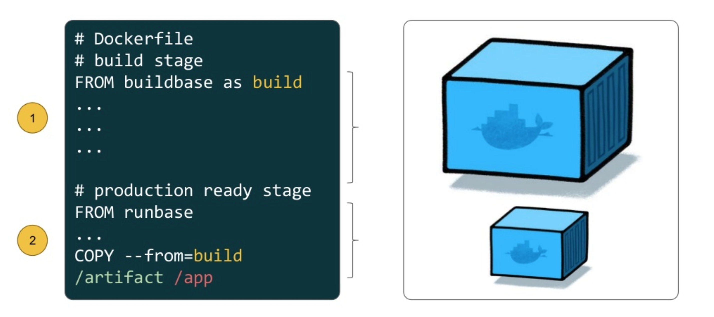

Multi-stage builds
==================

Multi-stage builds (introduced in Docker version 17.06 CE) allow users to create Dockerfiles that contain
multiple build stages. With this in place, you can then copy build artifacts from one stage to
another while leaving behind all the dependencies that were required to perform the build. This is
another tool used to build more optimized Docker images. Each stage in the build is started with
a ``FROM`` statement in the Dockerfile.

  Multiple stages of a Dockerfile

Prerequisites
-------------

- Mac

  - `Docker Desktop for Mac <https://docs.docker.com/desktop/install/mac-install/>`_

- Windows

  - `Docker Desktop for Windows <https://docs.docker.com/desktop/install/windows-install/>`_
- Linux

  - `Desktop <https://docs.docker.com/desktop/install/linux-install/>`_ or `Engine (CLI) <https://docs.docker.com/engine/install/>`_

A simple example
----------------

Let's create a very simple `Go <https://go.dev/>`_ application:

.. code-block:: console

  $ cd ~/
  $ mkdir hellogo/
  $ cd hellogo/
  $ touch Dockerfile
  $ pwd
  /Users/username/hellogo/
  $ ls
  Dockerfile

Now, grab a copy of the Go source code that we want to containerize:

.. code-block:: golang

  package main

  import (
      "fmt"
      "os/user"
  )

  func main () {
      user, err := user.Current()
      if err != nil {
          panic(err)
      }

      fmt.Println("Hello, " + user.Username + "!")
  }

You can cut and paste the code block above into a new file called,
``app.go``, or download it from the following link: `https://raw.githubusercontent.com/TACC/containers_at_tacc/main/docs/scripts/app.go <https://raw.githubusercontent.com/TACC/containers_at_tacc/main/docs/scripts/app.go>`_

Now, you should have two files and nothing else in this folder:

.. code-block:: console

   $ pwd
   /Users/username/hellogo/
   $ ls
   Dockerfile  app.go

Edit the Dockerfile and enter the following:

.. code-block:: dockerfile

  FROM golang:1.21
  WORKDIR /src

  COPY app.go .

  RUN CGO_ENABLED=0 go build -o /usr/local/bin/hello ./app.go

  CMD [ "/usr/local/bin/hello" ]

We're going to base our image on the official Go image
(based on `Debian Bookworm <https://www.debian.org/releases/bookworm/>`_) and specify a tagged
version (1.21). Then, we're going to simply copy in the Go source code (``app.go``) and compile it to an
executable called ``hello``. Running this executable will also be our default command. Next, we'll create
a Docker image and run a container from that image:

.. code-block:: console

  $ docker build -t <username>/hellogo:0.0.1 .
  [+] Building 5.7s (8/8) FINISHED                                                                                  docker:desktop-linux
   => [internal] load build definition from Dockerfile                                                                              0.1s
   => => transferring dockerfile: 162B                                                                                              0.1s
   => [internal] load .dockerignore                                                                                                 0.1s
   => => transferring context: 2B                                                                                                   0.0s
   => [internal] load metadata for docker.io/library/golang:1.21                                                                    0.0s
   => [internal] load build context                                                                                                 0.0s
   => => transferring context: 28B                                                                                                  0.0s
   => CACHED [1/3] FROM docker.io/library/golang:1.21                                                                               0.0s
   => [2/3] COPY app.go .                                                                                                           0.2s
   => [3/3] RUN CGO_ENABLED=0 go build -o /usr/local/bin/hello ./app.go                                                             5.0s
   => exporting to image                                                                                                            0.2s
   => => exporting layers                                                                                                           0.2s
   => => writing image sha256:d7ba5612bc490f5645eda701b179ce2ecce4f51280bae66db7e5ea7ccbf2a79d                                      0.0s
   => => naming to docker.io/eriksf/hellogo:0.0.1
  $ docker run --rm <username>/hellogo:0.0.1
  Hello, root!

Let's take a look at the size of our image:

.. code-block:: console

  $ docker images <username>/hellogo
  REPOSITORY       TAG       IMAGE ID       CREATED             SIZE
  eriksf/hellogo   0.0.1     d7ba5612bc49   3 minutes ago       851MB

OK, let's see if we can reduce the size of our image by using multiple stages. Create a new
Dockerfile named ``Dockerfile.ms``.

.. code-block:: console

  $ touch Dockerfile.ms
  $ pwd
  /Users/username/hellogo/
  $ ls
  Dockerfile  Dockerfile.ms  app.go

Edit ``Dockerfile.ms`` and enter the following:

.. code-block:: dockerfile

  FROM golang:1.21 AS build
  WORKDIR /src

  COPY app.go .

  RUN CGO_ENABLED=0 go build -o /usr/local/bin/hello ./app.go

  FROM alpine:3.18.3

  COPY --from=build /usr/local/bin/hello /usr/local/bin/hello

  CMD [ "/usr/local/bin/hello" ]

We've now got a Dockerfile with two build stages (starting with the ``FROM`` statements). The first stage grabs
an image with all the Go tools installed, copies in our source code, and compiles it to an executable. In the
second stage, we start with an `Alpine linux <https://www.alpinelinux.org/>`_ image (small, simple, and lightweight
Linux distribution) and then just copy in the executable from the build stage while jettisoning all the Go tools.

.. note::

  Note that we named our build stage, ``FROM golang:1.21 as build``. This makes it easier to read and
  identify the stage when copying from it.

Now, we'll create a new Docker image and run a container from that new image:

.. code-block:: console

  $ docker build -t <username>/hellogo:0.0.2 -f Dockerfile.ms .
  [+] Building 6.7s (13/13) FINISHED                                                                                docker:desktop-linux
   => [internal] load build definition from Dockerfile.ms                                                                           0.1s
   => => transferring dockerfile: 270B                                                                                              0.0s
   => [internal] load .dockerignore                                                                                                 0.1s
   => => transferring context: 2B                                                                                                   0.0s
   => [internal] load metadata for docker.io/library/alpine:3.18.3                                                                  1.2s
   => [internal] load metadata for docker.io/library/golang:1.21                                                                    0.0s
   => [auth] library/alpine:pull token for registry-1.docker.io                                                                     0.0s
   => [build 1/4] FROM docker.io/library/golang:1.21                                                                                0.0s
   => CACHED [stage-1 1/2] FROM docker.io/library/alpine:3.18.3@sha256:7144f7bab3d4c2648d7e59409f15ec52a18006a128c733fcff20d3a4a54  0.0s
   => CACHED [build 2/4] WORKDIR /src                                                                                               0.0s
   => [internal] load build context                                                                                                 0.0s
   => => transferring context: 28B                                                                                                  0.0s
   => [build 3/4] COPY app.go .                                                                                                     0.2s
   => [build 4/4] RUN CGO_ENABLED=0 go build -o /usr/local/bin/hello ./app.go                                                       4.8s
   => [stage-1 2/2] COPY --from=build /usr/local/bin/hello /usr/local/bin/hello                                                     0.2s
   => exporting to image                                                                                                            0.1s
   => => exporting layers                                                                                                           0.1s
   => => writing image sha256:2c2ab690cadf84cbf0f03d87effea87b1ff7726db0a4c3aabfbd18c3656975a4                                      0.0s
   => => naming to docker.io/eriksf/hellogo:0.0.2
  $ docker run --rm <username>/hellogo:0.0.2
  Hello, root!

.. note::

  As a debugging tool, you can also stop the build at a specific stage, i.e.
  ``docker build --target build -t <username>/hellogo:0.0.2 -f Dockerfile.ms .``.

Finally, let's see if we actually reduced our image size by using the multi-stage build.

.. code-block:: console

  $ docker images <username>/hellogo
  REPOSITORY       TAG       IMAGE ID       CREATED          SIZE
  eriksf/hellogo   0.0.2     2c2ab690cadf   7 minutes ago    9.62MB
  eriksf/hellogo   0.0.1     d7ba5612bc49   27 minutes ago   851MB

.. note::

  When using multi-stage builds, you are not limited to only copying from stages created earlier in the Dockerfile.
  You can also copy from another image, either locally or on another registry. For example,
  ``COPY --from=nginx:latest /etc/nginx/nginx.conf /nginx.conf``, which will get the latest nginx image from
  Docker Hub and grab only the default configuration file.

A real-world example
--------------------

Let's take a look at a more robust, real-world example. Pull a copy of the
`calculate-pi (https://github.com/eriksf/calculate-pi) <https://github.com/eriksf/calculate-pi>`_
project from GitHub.

.. note::

  Rather than clone my calculate-pi repository at `https://github.com/eriksf/calculate-pi <https://github.com/eriksf/calculate-pi>`_,
  it's better to fork it and clone your own repository.

.. code-block:: console

  $ git clone git@github.com:<username>/calculate-pi.git
  $ cd calculate-pi
  $ tree .
  .
  ├── calculate_pi
  │   ├── __init__.py
  │   ├── pi.py
  │   └── version.py
  ├── Dockerfile
  ├── LICENSE.txt
  ├── pyproject.toml
  ├── README.md
  ├── tests
  │   ├── __init__.py
  │   ├── responses
  │   │   └── help.txt
  │   └── test_calculate_pi.py
  └── uv.lock

  4 directories, 11 files 

In the :ref:`Containerize Your Code <install_code_interactively>` section, we introduced some Python
code to calculate Pi. This is basically the same code but built using
`uv <https://docs.astral.sh/uv/>`_ and adding in the `Click <https://click.palletsprojects.com/en/8.1.x/>`_
module for creating a command line interface. uv is a tool for Python packaging and dependency management.
It is a bit like having a dependency manager and a virtual environment rolled into one with the ability
to handle publishing to `PyPI <https://pypi.org/>`_ as well.

The important file that controls the package and dependencies is ``pyproject.toml``.

.. code-block:: console

  $ cat pyproject.toml
  [project]
  name = "calculate-pi"
  version = "0.5.0"
  description = "Calculate Pi python poetry project demo"
  authors = [{ name = "Erik Ferlanti", email = "eferlanti@tacc.utexas.edu" }]
  requires-python = "~=3.12.0"
  readme = "README.md"
  license = "BSD-3-Clause"
  dependencies = [
      "click>=8.1.7,<9",
      "click-loglevel>=0.6.1",
  ]

  [project.urls]
  Repository = "https://github.com/eriksf/calculate-pi"

  [project.scripts]
  calculate-pi = "calculate_pi.pi:main"

  [dependency-groups]
  dev = [
      "pytest>=8.3.2,<9",
      "pytest-cov>=6.2.1",
      "ruff>=0.12.8",
  ]

  [tool.hatch.build.targets.sdist]
  include = ["calculate_pi"]

  [tool.hatch.build.targets.wheel]
  include = ["calculate_pi"]

  [tool.bumpversion]
  current_version = "0.5.0"
  parse = "(?P<major>\\d+)\\.(?P<minor>\\d+)\\.(?P<patch>\\d+)"
  serialize = ["{major}.{minor}.{patch}"]
  search = "{current_version}"
  replace = "{new_version}"
  regex = false
  ignore_missing_version = false
  ignore_missing_files = false
  tag = false
  sign_tags = false
  tag_name = "v{new_version}"
  tag_message = "Bump version: {current_version} → {new_version}"
  allow_dirty = true
  commit = false
  message = "Bump version: {current_version} → {new_version}"
  moveable_tags = []
  commit_args = ""
  setup_hooks = []
  pre_commit_hooks = []
  post_commit_hooks = []

  [[tool.bumpversion.files]]
  filename = "calculate_pi/version.py"

  [build-system]
  requires = ["hatchling"]
  build-backend = "hatchling.build"

  [tool.ruff]
  exclude = [".git", ".ruff_cache", ".vscode"]
  line-length = 300

  [tool.ruff.lint]
  select = ["E", "F", "I"]
  fixable = ["ALL"]
  unfixable = ["F401"]

  [tool.pytest.ini_options]
  addopts = "--verbose --cov=calculate_pi"

We show this file only to give some insight into how the Dockerfile will used to build the project. In this
new uv-based calculate-pi Python package, we'll discuss each of the important Dockerfile sections in detail.

In stage 1 (base stage), we're going to base our image on a tagged version (3.12.11) of the official Python image
(based on `Debian Bookworm <https://www.debian.org/releases/bookworm/>`_), label it ``base``,
and then install some system updates.

.. code-block:: dockerfile

  FROM python:3.12.11-bookworm AS base

  # Update OS
  RUN apt-get update \
      && DEBIAN_FRONTEND=noninteractive apt-get install -y \
          vim-tiny \
      && apt-get autoremove -y \
      && apt-get clean \
      && rm -rf /var/lib/apt/lists/*

Next, in the second stage (builder stage), we will copy in the ``uv`` executable, set the working directory (``/calculate_pi``),
and use ``uv`` to install the Python dependencies listed in ``pyproject.toml``. We will then copy in the project files
and use ``uv`` again to install the project.

.. code-block:: dockerfile

  FROM base AS builder
  COPY --from=ghcr.io/astral-sh/uv:0.8.9 /uv /bin/uv
  ENV UV_COMPILE_BYTECODE=1 UV_LINK_MODE=copy

  WORKDIR /calculate_pi

  COPY uv.lock pyproject.toml /calculate_pi/
  RUN --mount=type=cache,target=/root/.cache/uv \
      uv sync --frozen --no-install-project --no-dev
  COPY calculate_pi /calculate_pi/calculate_pi/
  COPY README.md LICENSE.txt /calculate_pi/
  RUN --mount=type=cache,target=/root/.cache/uv \
      uv sync --frozen --no-dev

In the final stage (runtime stage), we will set the maintainer label, configure some Python environment
variables, set the WORKDIR, copy the ``/calculate_pi`` directory from the builder stage, set the PATH
environment variable, and then set the default command to run the help for the ``calculate-pi``
command. The important thing to take away here is that we're copying in the ``/calculate_pi``
directory from the builder stage, which contains all the files we need to run the project, and
jettisoning the rest of the build dependencies. This is a common pattern in multi-stage builds, where
we want to keep the final image as small as possible by only including the files we need to run
the project.

.. code-block:: dockerfile

  FROM base AS final
  LABEL maintainer="Erik Ferlanti <eferlanti@tacc.utexas.edu>"

  # Configure Python/Pip
  ENV PYTHONUNBUFFERED=1 \
      PYTHONDONTWRITEBYTECODE=1 \
      PYTHONFAULTHANDLER=1

  WORKDIR /calculate_pi

  COPY --from=builder /calculate_pi /calculate_pi
  ENV PATH="/calculate_pi/.venv/bin:$PATH"

  CMD [ "calculate-pi", "--help" ]

For reference, here's what the Dockerfile looks like in total:

.. code-block:: dockerfile

  FROM python:3.12.11-bookworm AS base

  # Update OS
  RUN apt-get update \
      && DEBIAN_FRONTEND=noninteractive apt-get install -y \
          vim-tiny \
      && apt-get autoremove -y \
      && apt-get clean \
      && rm -rf /var/lib/apt/lists/*

  FROM base AS builder
  COPY --from=ghcr.io/astral-sh/uv:0.8.9 /uv /bin/uv
  ENV UV_COMPILE_BYTECODE=1 UV_LINK_MODE=copy

  WORKDIR /calculate_pi

  COPY uv.lock pyproject.toml /calculate_pi/
  RUN --mount=type=cache,target=/root/.cache/uv \
      uv sync --frozen --no-install-project --no-dev
  COPY calculate_pi /calculate_pi/calculate_pi/
  COPY README.md LICENSE.txt /calculate_pi/
  RUN --mount=type=cache,target=/root/.cache/uv \
      uv sync --frozen --no-dev

  FROM base AS final
  LABEL maintainer="Erik Ferlanti <eferlanti@tacc.utexas.edu>"

  # Configure Python/Pip
  ENV PYTHONUNBUFFERED=1 \
      PYTHONDONTWRITEBYTECODE=1 \
      PYTHONFAULTHANDLER=1

  WORKDIR /calculate_pi

  COPY --from=builder /calculate_pi /calculate_pi
  ENV PATH="/calculate_pi/.venv/bin:$PATH"

  CMD [ "calculate-pi", "--help" ]

In review, what we've done with this build in stages one and two is to set up Python and uv to produce the only
build artifacts necessary to install our **calculate-pi** package. Then, in the final stage, we copy in the build
artifacts from the build stage and install them in our base image (getting rid of all the tools necessary
for the build). Let's go ahead and build the image.

.. code-block:: console

  $ docker build -t <username>/calculate_pi:0.5.0 .
  [+] Building 24.4s (19/19) FINISHED                                                                                                          docker:desktop-linux
  => [internal] load build definition from Dockerfile                                                                                                         0.0s
  => => transferring dockerfile: 1.06kB                                                                                                                       0.0s
  => [internal] load metadata for ghcr.io/astral-sh/uv:0.8.9                                                                                                  1.1s
  => [internal] load metadata for docker.io/library/python:3.12.11-bookworm                                                                                   1.1s
  => [auth] library/python:pull token for registry-1.docker.io                                                                                                0.0s
  => [internal] load .dockerignore                                                                                                                            0.0s
  => => transferring context: 2B                                                                                                                              0.0s
  => FROM ghcr.io/astral-sh/uv:0.8.9@sha256:cda9608307dbbfc1769f3b6b1f9abf5f1360de0be720f544d29a7ae2863c47ef                                                  5.9s
  => => resolve ghcr.io/astral-sh/uv:0.8.9@sha256:cda9608307dbbfc1769f3b6b1f9abf5f1360de0be720f544d29a7ae2863c47ef                                            0.0s
  => => sha256:1015f2d99b7877b42be490212a8c828493b7c944fe2ac5e27bb2352de5506887 1.30kB / 1.30kB                                                               0.0s
  => => sha256:cda9608307dbbfc1769f3b6b1f9abf5f1360de0be720f544d29a7ae2863c47ef 2.19kB / 2.19kB                                                               0.0s
  => => sha256:0d4fc9bfe2e3901e058622bc7a258ffdca0e37869dfcd6f723ffe1ac987aa95a 669B / 669B                                                                   0.0s
  => => sha256:23c9609b40494aef882ecd6421eff7d95a1c3095063800ccffa1ac0886458e3a 18.38MB / 18.38MB                                                             5.7s
  => => sha256:d5c8c623479f3e02bf83619a31eeafe987ab33b37813810e0d507de25749b054 98B / 98B                                                                     3.6s
  => => extracting sha256:23c9609b40494aef882ecd6421eff7d95a1c3095063800ccffa1ac0886458e3a                                                                    0.2s
  => => extracting sha256:d5c8c623479f3e02bf83619a31eeafe987ab33b37813810e0d507de25749b054                                                                    0.0s
  => [base 1/2] FROM docker.io/library/python:3.12.11-bookworm@sha256:25d3f719b6f78043b583d1826cad77c78c06d661347d86e5725bdbb56d055fca                       17.1s
  => => resolve docker.io/library/python:3.12.11-bookworm@sha256:25d3f719b6f78043b583d1826cad77c78c06d661347d86e5725bdbb56d055fca                             0.0s
  => => sha256:8cff9c97e1a1ee42786188e1d1b57f6a2035d65b648178ac0262d0eba0c5c86d 23.57MB / 23.57MB                                                             1.2s
  => => sha256:c4910ed05e8b3022bc1c6adfffae5e35b0d2b4c6d756ee21311b48b509147a1a 64.37MB / 64.37MB                                                             3.4s
  => => sha256:405d31d0fff28e2b2bba2c79075445ac31ba64897b1e57905262e3de18a896da 6.47kB / 6.47kB                                                               0.0s
  => => sha256:25d3f719b6f78043b583d1826cad77c78c06d661347d86e5725bdbb56d055fca 9.08kB / 9.08kB                                                               0.0s
  => => sha256:ef25d9093439300249f6bd25a9b4a1855dec8016af7caa3193c798a509a20478 2.33kB / 2.33kB                                                               0.0s
  => => sha256:35f134665ae4469a16b5b7b841e9efe6b186960e0533131b3603e4816aabeb3a 48.34MB / 48.34MB                                                             1.8s
  => => sha256:8325efcffd02810e02c94ef0cf141d88f021fdac3fd247613e996624eb84fb23 202.86MB / 202.86MB                                                          11.9s
  => => sha256:90a24e2bc94c47fd9a3b35aee36d698dd48410fcaf6d16588d4c8f0ccddc51fd 6.24MB / 6.24MB                                                               2.4s
  => => extracting sha256:35f134665ae4469a16b5b7b841e9efe6b186960e0533131b3603e4816aabeb3a                                                                    2.1s
  => => sha256:f946a2193edf962b527cd19dfefad80a67d7f015619eab742a5903522239a466 24.92MB / 24.92MB                                                             3.3s
  => => sha256:31aaf295ce5d03293f62862f9c7eac43166fbb50d3c6cdcbb8cdd732e234f6f2 250B / 250B                                                                   3.5s
  => => extracting sha256:8cff9c97e1a1ee42786188e1d1b57f6a2035d65b648178ac0262d0eba0c5c86d                                                                    0.5s
  => => extracting sha256:c4910ed05e8b3022bc1c6adfffae5e35b0d2b4c6d756ee21311b48b509147a1a                                                                    2.1s
  => => extracting sha256:8325efcffd02810e02c94ef0cf141d88f021fdac3fd247613e996624eb84fb23                                                                    4.3s
  => => extracting sha256:90a24e2bc94c47fd9a3b35aee36d698dd48410fcaf6d16588d4c8f0ccddc51fd                                                                    0.2s
  => => extracting sha256:f946a2193edf962b527cd19dfefad80a67d7f015619eab742a5903522239a466                                                                    0.5s
  => => extracting sha256:31aaf295ce5d03293f62862f9c7eac43166fbb50d3c6cdcbb8cdd732e234f6f2                                                                    0.0s
  => [internal] load build context                                                                                                                            0.0s
  => => transferring context: 41.03kB                                                                                                                         0.0s
  => [base 2/2] RUN apt-get update     && DEBIAN_FRONTEND=noninteractive apt-get install -y         vim-tiny     && apt-get autoremove -y     && apt-get cle  4.2s
  => [builder 1/7] COPY --from=ghcr.io/astral-sh/uv:0.8.9 /uv /bin/uv                                                                                         0.1s
  => [final 1/2] WORKDIR /calculate_pi                                                                                                                        0.0s
  => [builder 2/7] WORKDIR /calculate_pi                                                                                                                      0.0s
  => [builder 3/7] COPY uv.lock pyproject.toml /calculate_pi/                                                                                                 0.0s
  => [builder 4/7] RUN --mount=type=cache,target=/root/.cache/uv     uv sync --frozen --no-install-project --no-dev                                           0.5s
  => [builder 5/7] COPY calculate_pi /calculate_pi/calculate_pi/                                                                                              0.1s
  => [builder 6/7] COPY README.md LICENSE.txt /calculate_pi/                                                                                                  0.0s
  => [builder 7/7] RUN --mount=type=cache,target=/root/.cache/uv     uv sync --frozen --no-dev                                                                0.8s
  => [final 2/2] COPY --from=builder /calculate_pi /calculate_pi                                                                                              0.0s
  => exporting to image                                                                                                                                       0.0s
  => => exporting layers                                                                                                                                      0.0s
  => => writing image sha256:3a8e964bc8f5de05b296a0604b78de5873554857511ba97e6779d4b0143b1132                                                                 0.0s
  => => naming to docker.io/eriksf/calculate_pi:0.5.0                                                                                                         0.0s

  What's next:
      View a summary of image vulnerabilities and recommendations → docker scout quickview

Now, let's run a container from that image:

.. code-block:: console

  $ docker run --rm eriksf/calculate_pi:0.5.0
  Usage: calculate-pi [OPTIONS] NUMBER

    Calculate pi using a Monte Carlo estimation.

    NUMBER is the number of random points.

  Options:
    --version                       Show the version and exit.
    --log-level [NOTSET|DEBUG|INFO|WARNING|ERROR|CRITICAL]
                                    Set the log level  [default: 20]
    --log-file PATH                 Set the log file
    --help                          Show this message and exit.
  $ docker run --rm eriksf/calculate_pi:0.5.0 calculate-pi 1000000
  Final pi estimate from 1000000 attempts = 3.142988

Additional Resources
^^^^^^^^^^^^^^^^^^^^

* `Demo Repository <https://github.com/eriksf/calculate-pi>`_
* `Python pyproject.toml file <https://pip.pypa.io/en/stable/reference/build-system/pyproject-toml/>`_
* `Python pip package installer <https://pip.pypa.io/en/stable/>`_
* `Python Poetry package manager <https://python-poetry.org/>`_
* `Click package for command-line interfaces <https://click.palletsprojects.com/en/8.1.x/>`_
* `Python wheel <https://realpython.com/python-wheels/>`_
