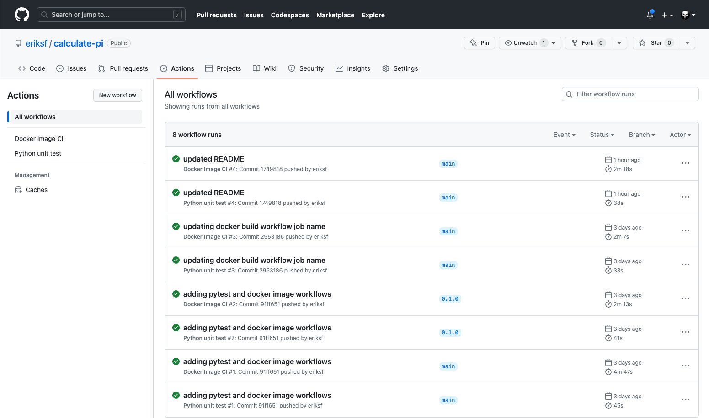
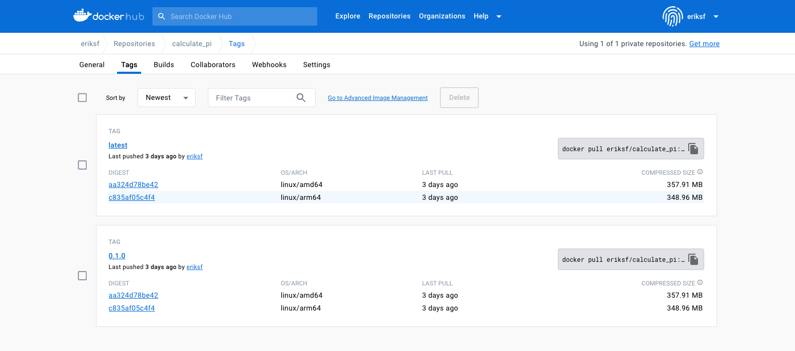

Multi-architecture builds
=========================

Multi-architecture (also known as multi-platform) builds create a Docker image that can support multiple
architectures (i.e. linux/amd64, linux/arm64, linux/ppc64le, etc). This is really important if you know
that your image has to be run on machines with different architectures and/or you're developing an image
for others to use and you want to support that.

Prerequisites
-------------

- Mac

  - `Docker Desktop for Mac <https://docs.docker.com/desktop/install/mac-install/>`_

- Windows

  - `Docker Desktop for Windows <https://docs.docker.com/desktop/install/windows-install/>`_
- Linux

  - `Docker Engine <https://docs.docker.com/engine/install/>`_
  - `Host or Docker Image-based installation of emulation tools <https://medium.com/@artur.klauser/building-multi-architecture-docker-images-with-buildx-27d80f7e2408/>`_

Building for an architecture different than the one the operating system is running on requires emulation. Fortunately,
for users of Mac and Windows, the Docker Desktop includes `QEMU <https://www.qemu.org/>`_ which is an open source machine
emulator and virtualizer so nothing else needs to be installed. On a Linux system, QEMU and a few other tools need to
be installed on the host or by using a special Docker image (see `qemu-user-static <https://github.com/multiarch/qemu-user-static>`_).

.. figure:: ../images/docker_desktop_emulation.png
  :width: 600
  :align: center

  How does it work?

A simple example
----------------

Let's create a very simple Dockerfile:

.. code-block:: console

  $ cd ~/
  $ mkdir curl-container/
  $ cd curl-container/
  $ touch Dockerfile
  $ pwd
  /Users/username/curl-container/
  $ ls
  Dockerfile

Now, edit the Dockerfile and enter the following:

.. code-block:: dockerfile

   FROM alpine:3.15.0
   LABEL maintainer="Erik Ferlanti <eferlanti@tacc.utexas.edu>"

   RUN apk add --no-cache curl

   CMD ["curl"]

.. note::

  The important thing when building an image for multiple architectures is to make sure that the base image
  (FROM line) supports multiple architectures (see `alpine at Docker Hub <https://hub.docker.com/_/alpine/tags?page=1&name=3.15.0>`_).

Target a single platform
^^^^^^^^^^^^^^^^^^^^^^^^

For targeting a single platform (other than the one your on), it is simple enough to use the ``--platform`` option
of the standard ``docker build`` command.

.. code-block:: console

  $ docker build --platform linux/amd64 -t <username>/curl-example:0.0.1 .

Once it builds, lets inspect the image to make sure it actually targeted the correct platform:

.. code-block:: console

  $ docker inspect <username>/curl-example:0.0.1 | grep Architecture
        "Architecture": "amd64",

And, finally, lets run the image and print out the platform to make sure it works:

.. code-block:: console

  $ docker run --rm -t --platform linux/amd64 eriksf/curl-example:0.0.1 uname -m
  x86_64

.. note::

  If you don't specify the ``--platform`` option when running a container of a different architecture, you'll
  probably see a warning message similar to *WARNING: The requested image's platform (linux/amd64) does not
  match the detected host platform (linux/arm64/v8) and no specific platform was requested*, though it will still
  run.

Targeting multiple platforms
^^^^^^^^^^^^^^^^^^^^^^^^^^^^

For targeting multiple platforms, we'll need to use a different command called ``docker buildx``. Let's start
by listing the current builders. A builder is a `BuildKit <https://docs.docker.com/build/buildkit/>`_
(the build engine that solves the build steps in a Dockerfile) daemon used to run your builds.

.. code-block:: console

  $ docker buildx ls
  NAME/NODE       DRIVER/ENDPOINT STATUS  BUILDKIT             PLATFORMS
  default         docker
  default       default         running v0.11.6+616c3f613b54 linux/arm64, linux/amd64, linux/amd64/v2, linux/riscv64, linux/ppc64le, linux/s390x, linux/386, linux/mips64le, linux/mips64, linux/arm/v7, linux/arm/v6
  desktop-linux * docker
  desktop-linux desktop-linux   running v0.11.6+616c3f613b54 linux/arm64, linux/amd64, linux/amd64/v2, linux/riscv64, linux/ppc64le, linux/s390x, linux/386, linux/mips64le, linux/mips64, linux/arm/v7, linux/arm/v6

Now, let's create a new builder for multiple platforms using the docker-container driver:

.. code-block:: console

  $ docker buildx create --name mybuilder --bootstrap --use
  [+] Building 9.2s (1/1) FINISHED
   => [internal] booting buildkit                                                                                                   9.2s
   => => pulling image moby/buildkit:buildx-stable-1                                                                                4.8s
   => => creating container buildx_buildkit_mybuilder0                                                                              4.4s
  mybuilder

And running ``docker buildx ls`` again should show us the new builder which is now the default.

.. code-block:: console

  $ docker buildx ls
  NAME/NODE       DRIVER/ENDPOINT  STATUS  BUILDKIT             PLATFORMS
  mybuilder *     docker-container
  mybuilder0    desktop-linux    running v0.12.2              linux/arm64, linux/amd64, linux/amd64/v2, linux/riscv64, linux/ppc64le, linux/s390x, linux/386, linux/mips64le, linux/mips64, linux/arm/v7, linux/arm/v6
  default         docker
  default       default          running v0.11.6+616c3f613b54 linux/arm64, linux/amd64, linux/amd64/v2, linux/riscv64, linux/ppc64le, linux/s390x, linux/386, linux/mips64le, linux/mips64, linux/arm/v7, linux/arm/v6
  desktop-linux   docker
  desktop-linux desktop-linux    running v0.11.6+616c3f613b54 linux/arm64, linux/amd64, linux/amd64/v2, linux/riscv64, linux/ppc64le, linux/s390x, linux/386, linux/mips64le, linux/mips64, linux/arm/v7, linux/arm/v6

Let's now build our example image for multiple platforms with ``docker buildx``.

.. code-block:: console

  $ docker buildx build --platform linux/arm64,linux/amd64 -t <username>/curl-example:0.0.1 .
  [+] Building 13.3s (9/9) FINISHED                                                                           docker-container:mybuilder
   => [internal] load build definition from Dockerfile                                                                              8.8s
   => => transferring dockerfile: 160B                                                                                              0.0s
   => [linux/amd64 internal] load metadata for docker.io/library/alpine:3.15.0                                                      2.2s
   => [linux/arm64 internal] load metadata for docker.io/library/alpine:3.15.0                                                      2.2s
   => [auth] library/alpine:pull token for registry-1.docker.io                                                                     0.0s
   => [internal] load .dockerignore                                                                                                 0.0s
   => => transferring context: 2B                                                                                                   0.0s
   => [linux/amd64 1/2] FROM docker.io/library/alpine:3.15.0@sha256:21a3deaa0d32a8057914f36584b5288d2e5ecc984380bc0118285c70fa8c93  0.4s
   => => resolve docker.io/library/alpine:3.15.0@sha256:21a3deaa0d32a8057914f36584b5288d2e5ecc984380bc0118285c70fa8c9300            0.0s
   => => sha256:59bf1c3509f33515622619af21ed55bbe26d24913cedbca106468a5fb37a50c3 2.82MB / 2.82MB                                    0.2s
   => => extracting sha256:59bf1c3509f33515622619af21ed55bbe26d24913cedbca106468a5fb37a50c3                                         0.1s
   => [linux/arm64 1/2] FROM docker.io/library/alpine:3.15.0@sha256:21a3deaa0d32a8057914f36584b5288d2e5ecc984380bc0118285c70fa8c93  0.4s
   => => resolve docker.io/library/alpine:3.15.0@sha256:21a3deaa0d32a8057914f36584b5288d2e5ecc984380bc0118285c70fa8c9300            0.0s
   => => sha256:9b3977197b4f2147bdd31e1271f811319dcd5c2fc595f14e81f5351ab6275b99 2.72MB / 2.72MB                                    0.2s
   => => extracting sha256:9b3977197b4f2147bdd31e1271f811319dcd5c2fc595f14e81f5351ab6275b99                                         0.1s
   => [linux/amd64 2/2] RUN apk add --no-cache curl                                                                                 1.8s
   => [linux/arm64 2/2] RUN apk add --no-cache curl                                                                                 1.5s
  WARNING: No output specified with docker-container driver. Build result will only remain in the build cache. To push result image into registry use --push or to load image into docker use --load

Notice the warning message printed at the end of the log. Since you can't have multiple images of the same name with
different architectures, it doesn't load anything into the Docker daemon (running ``docker images`` would confirm that) and
just keeps them in the build cache. In order to successfully create the manifest and push them to Docker Hub,
you must include the ``--push`` option.

.. code-block:: console

  $ docker buildx build --platform linux/arm64,linux/amd64 -t <username>/curl-example:0.0.1 --push .
  [+] Building 5.0s (11/11) FINISHED                                                                          docker-container:mybuilder
   => [internal] load build definition from Dockerfile                                                                              0.1s
   => => transferring dockerfile: 160B                                                                                              0.0s
   => [linux/amd64 internal] load metadata for docker.io/library/alpine:3.15.0                                                      0.7s
   => [linux/arm64 internal] load metadata for docker.io/library/alpine:3.15.0                                                      0.7s
   => [auth] library/alpine:pull token for registry-1.docker.io                                                                     0.0s
   => [internal] load .dockerignore                                                                                                 0.0s
   => => transferring context: 2B                                                                                                   0.0s
   => [linux/arm64 1/2] FROM docker.io/library/alpine:3.15.0@sha256:21a3deaa0d32a8057914f36584b5288d2e5ecc984380bc0118285c70fa8c93  0.0s
   => => resolve docker.io/library/alpine:3.15.0@sha256:21a3deaa0d32a8057914f36584b5288d2e5ecc984380bc0118285c70fa8c9300            0.0s
   => [linux/amd64 1/2] FROM docker.io/library/alpine:3.15.0@sha256:21a3deaa0d32a8057914f36584b5288d2e5ecc984380bc0118285c70fa8c93  0.0s
   => => resolve docker.io/library/alpine:3.15.0@sha256:21a3deaa0d32a8057914f36584b5288d2e5ecc984380bc0118285c70fa8c9300            0.0s
   => CACHED [linux/arm64 2/2] RUN apk add --no-cache curl                                                                          0.0s
   => CACHED [linux/amd64 2/2] RUN apk add --no-cache curl                                                                          0.0s
   => exporting to image                                                                                                            4.1s
   => => exporting layers                                                                                                           0.2s
   => => exporting manifest sha256:14070f03fa3dc0b168ed8bbe29cc88dd83c7658697f2915354bca13c905de276                                 0.0s
   => => exporting config sha256:c37ff46d2eb25cff241cf466f4f3a4ca022bf0e9df15f647e0501b544e62e470                                   0.0s
   => => exporting attestation manifest sha256:b41bea9e810f966e14bec642d80c4e085a9ea2e9467015ca60b6353d2509c627                     0.0s
   => => exporting manifest sha256:682d682934dbe32d843462d468bed2f8ae33b61b27fa254af2730987b8dc9635                                 0.0s
   => => exporting config sha256:eb1c0b2fc38664d00af8a0c488f4c8ef72c753ef24ce1c5c1e08d37698b16b7b                                   0.0s
   => => exporting attestation manifest sha256:aa5c11083c2fa40eb3be2950e74a05712dfa965cd6cfb553a4b4f7694df91e6f                     0.1s
   => => exporting manifest list sha256:9d8106720c79d7e3a351fb7beaccbcddfcb3d44d95c8c05268fa3a27e4f915c4                            0.0s
   => => pushing layers                                                                                                             2.2s
   => => pushing manifest for docker.io/eriksf/curl-example:0.0.1@sha256:9d8106720c79d7e3a351fb7beaccbcddfcb3d44d95c8c05268fa3a27e  1.4s
   => [auth] eriksf/curl-example:pull,push token for registry-1.docker.io

And now if we check Docker Hub, we'll see that our images were successfully pushed up to the repository.

  Docker Hub curl-example repository.

Notice that if we pull our image down from Docker Hub, it will pull the one matching our current
architecture.

.. code-block:: console

  $ docker pull <username>/curl-example:0.0.1
  0.0.1: Pulling from eriksf/curl-example
  9b3977197b4f: Already exists
  5c8f3aefc39d: Pull complete
  Digest: sha256:9d8106720c79d7e3a351fb7beaccbcddfcb3d44d95c8c05268fa3a27e4f915c4
  Status: Downloaded newer image for eriksf/curl-example:0.0.1
  docker.io/eriksf/curl-example:0.0.1
  $ docker inspect <username>/curl-example:0.0.1 | grep Architecture
        "Architecture": "arm64",

Finally, let's run the container to make sure it works.

.. code-block:: console

  $ docker run -t <username>/curl-example:0.0.1 uname -m
  aarch64

Docker Hub Integration with GitHub Actions
------------------------------------------

**GitHub Actions** is a relatively new CI service used to automate, customize,
and execute software development workflows right in your GitHub repository.

* One interface for both your source code repositories and your CI/CD pipelines
* Catalog of available Actions you can utilize without reinventing the wheel
* Hosted services are subject to usage limits, although the free-tier limits are
  `fairly generous <https://docs.github.com/en/actions/learn-github-actions/usage-limits-billing-and-administration>`_
  (for now)
* Simple YAML descriptions of workflows, many templates and examples available
* It is a newer platform, so not as many features as some of the others, but it
  is quickly gaining steam

.. note::
    Rather than clone the calculate-pi repository at `https://github.com/eriksf/calculate-pi <https://github.com/eriksf/calculate-pi>`_,
    it's better to fork it and clone your own repository (`Fork a repo on GitHub <https://docs.github.com/en/get-started/quickstart/fork-a-repo>`_).

To see the GitHub Actions workflow in an existing repository, clone your calculate-pi repository as follows:

.. code-block:: console

   $ git clone git@github.com:<username>/calculate-pi.git
   $ cd calculate-pi
   $ ls -l .github/workflows
   total 8
   -rw-r--r-- 1 eriksf staff 1759 Sep 20 14:21 docker-image.yml
   -rw-r--r-- 1 eriksf staff  905 Sep 20 14:21 pytest.yml

Within that ``.github/workflows`` folder we will put YAML files describing when, how, and what workflows
should be triggered.

Rather than commit to GitHub AND push to Docker Hub each time you want to
release a new version of code, you can set up an integration between the two
services that automates it. The key benefit is you only have to commit to one
place (GitHub), and you can be sure the image on Docker Hub will always be in sync.

Consider the following docker build workflow, located in ``.github/workflows/docker-image.yml``:

.. code-block:: yaml

  name: Docker Image CI

  on:
    push:
      branches: [ "main" ]
      tags: [ "*.*.*" ]
    pull_request:
      branches: [ "main" ]

  jobs:

    build-calculate-pi:
      runs-on: ubuntu-latest

      steps:
        - name: Checkout repository
          uses: actions/checkout@v3

        - name: Set up QEMU
          uses: docker/setup-qemu-action@v2

        - name: Set up Docker Buildx
          id: buildx
          uses: docker/setup-buildx-action@v2

        - name: Cache Docker layers
          uses: actions/cache@v3
          with:
            path: /tmp/.buildx-cache
            key: ${{ runner.os }}-buildx-${{ github.sha }}
            restore-keys: |
              ${{ runner.os }}-buildx-

        - name: Docker metadata
          id: meta
          uses: docker/metadata-action@v4
          with:
            images: eriksf/calculate_pi
            flavor: latest=true
            tags: |
              type=ref, event=branch
              type=ref, event=pr
              type=semver, pattern={{version}}

        - name: Login to DockerHub
          if: github.ref_type == 'tag'
          uses: docker/login-action@v2
          with:
            username: ${{ secrets.DOCKERHUB_USERNAME }}
            password: ${{ secrets.DOCKERHUB_TOKEN }}

        - name: Build and push image
          uses: docker/build-push-action@v4
          with:
            context: .
            platforms: linux/amd64,linux/arm64
            push: ${{ github.ref_type == 'tag' }}
            tags: ${{ steps.meta.outputs.tags }}
            labels: ${{ steps.meta.outputs.labels }}
            cache-from: type=local,src=/tmp/.buildx-cache
            cache-to: type=local,dest=/tmp/.buildx-cache-new,mode=max

        - name: Move cache
          run: |
            rm -rf /tmp/.buildx-cache
            mv /tmp/.buildx-cache-new /tmp/.buildx-cache

This workflow is triggered on pushes or pull requests to the ``main`` branch or when a new tag is pushed
(``tag: - '*.*.*'``). The first step of this workflow checks out the code. Then, it uses a couple of different
actions to set up QEMU (for Multi-architecture builds), docker buildx, caching of the build layers,
and docker metadata to setup the repo name and version. It will attempt to use the ``docker/login-action``
to log in to Docker Hub on the command line only if the workflow is run based on a tag. The username and token
can be set by navigating to Settings => Secrets and variables => Actions => New Repository Secret within the project repository.

   Secrets are tied to specific repos.

Finally, this workflow will build the image for both the ``linux/amd64`` and ``linux/arm64`` platforms using
the build cache from previous runs if it exists (and hasn't changed). It will only push the image to Docker Hub
if the workflow is run based on a tag. This uses the ``docker/build-push-action`` from the GitHub Actions catalog.

.. tip::

   Don't re-invent the wheel when performing GitHub Actions. There is likely an
   existing action that already does what you're trying to do.

Trigger the Integration
~~~~~~~~~~~~~~~~~~~~~~~

To trigger the build in a real-world scenario, make some changes to your source
code, push your modified code to GitHub and tag the release as ``X.Y.Z`` (whatever
new tag is appropriate) to trigger another automated build:

.. code-block:: console

   $ git add *
   $ git commit -m "made some changes"
   $ git push
   $ git tag -a 0.1.0 -m "release version 0.1.0"
   $ git push origin 0.1.0

By default, the git push command does not transfer tags, so we are explicitly
telling git to push the tag we created (0.1.0) to the remote (origin).

Then navigate to the repo on GitHub and click the 'Actions' tab to watch the
progress of the Action. You can click on your saved workflows to narrow the view,
or click on a specific instance of a workflow (a "run") to see the logs.

   History of all workflow runs.

By looking through the history of recent workflow runs, you can see that each is
assigned to a specific commit and commit message. That way, you know
who to credit or blame for successful or errant runs.

Now check the Docker Hub repo to see if your new tag has been pushed.

   New tag automatically pushed.

Additional Resources
--------------------

* `GitHub Actions Docs <https://docs.github.com/en/actions>`_
* `Demo Repository <https://github.com/eriksf/calculate-pi>`_
