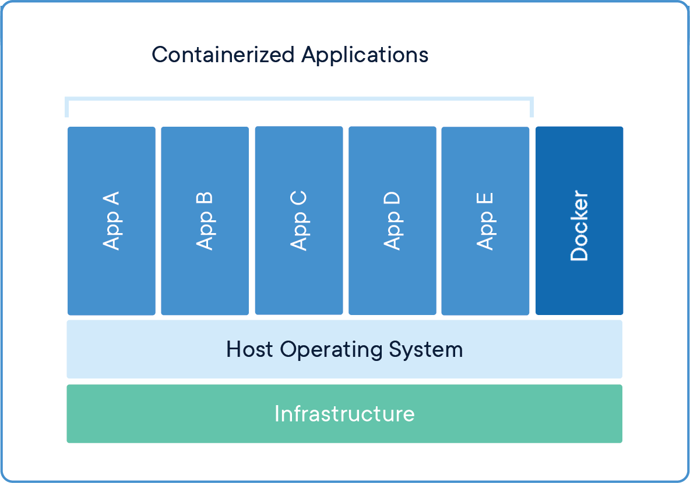

Introduction to Containers
==========================

Containers are an important common currency for app development, web services,
scientific computing, and more. Containers allow you to package an application
along with all of its dependencies, isolate it from other applications and
services, and deploy it consistently and reproducibly and *platform-agnostically*.
In this introductory module, we will learn about containers and their uses, in
particular the containerization platform **Docker**.

What is a Container?
--------------------

* A container is a standard unit of software that packages up code and all its
  dependencies so the application runs quickly and reliably from one computing
  environment to another.
* Containers allow a developer to package up an application with all of the
  parts it needs, such as libraries and other dependencies, and ship it all out
  as one package.
* Multiple containers can run on the same machine and share the OS kernel with
  other containers, each running as isolated processes in user space, hence are
  *lightweight* and have *low overhead*.
* Containers ensure *portability* and *reproducibility* by isolating the
  application from environment.

How is a Container Different from a VM?
---------------------------------------

Virtual machines enable application and resource isolation, run on top of a
hypervisor (high overhead). Multiple VMs can run on the same physical
infrastructure - from a few to dozens depending on resources. VMs take up more
disk space and have long start up times (~minutes).

.. figure:: images/arch_vm.png
   :width: 400
   :align: center

   Applications isolated by VMs.

Containers enable application and resource isolation, run on top of the host
operating system. Many containers can run on the same physical infrastructure -
up to 1,000s depending on resources. Containers take up less disk space than VMs
and have very short start up times (~100s of ms).

   Applications isolated by containers.

**Benefits of using containers include:**

* Platform independence: Build it once, run it anywhere
* Resource efficiency and density
* Enables reproducible science
* Effective isolation and resource sharing

Container Technologies
----------------------

Docker
~~~~~~

.. figure:: images/docker_logo.jpg
   :height: 180
   :width: 200
   :align: right
   :alt: Docker Logo
   :figclass: left

Docker is a containerization platform that uses OS-level virtualization to
package software and dependencies in deliverable units called containers. It is
by far the most common containerization platform today, and most other container
platforms are compatible with Docker. (E.g. Apptainer, Singularity, and Shifter
are other containerization platforms you may find in HPC environments).

Apptainer
~~~~~~~~~

Apptainer (a recent offshoot from Singularity) is a container solution designed to 
execute applications at bare-metal performance while being secure, portable, and 
100% reproducible. Apptainer's permissions model makes it a popular choice for
shared HPC environments where Docker cannot be supported. It has its own syntax
for building containers but also support pulling and running Docker containers.

In general we use **Docker** to develop new containers and run them on our laptops.
We use **Apptainer** as a runtime on our HPC systems.
We can find existing containers that are compatible with both Docker and Apptainer
platforms (among others) at:

1. `Docker Hub <https://hub.docker.com/>`_
2. `Quay.io <https://quay.io/>`_
3. `BioContainers <https://biocontainers.pro/#/>`_

Some Quick Definitions
----------------------

Dockerfile
~~~~~~~~~~

A Dockerfile is a recipe for creating a Docker image. It is a human-readable, 
plain text file that contains a sequential set of commands (*a recipe*) for 
installing and configuring an application and all of its dependencies. The Docker 
command line interface is used to interpret a Dockerfile and "build" an  image 
based on those instructions. Other container build environments, such as Apptainer, 
have different syntax for container recipes, but the function is the same.

Image
~~~~~

An image is a read-only template that contains all the code, dependencies,
libraries, and supporting files that are required to launch a container. Docker
stores images as layers, and any changes made to an image are captured by adding 
new layers. The "base image" is the bottom-most layer that does not depend on 
any other layer and typically defines the operating system for the container.

Container
~~~~~~~~~

A container is an instance of an image that can execute a software enviornment. 
Running a container requires a container runtime environment (e.g. Docker, 
Apptainer) and an instruction set architecture (e.g. x86) compatible with the 
image from which the container is instantiated.

Image Registry
~~~~~~~~~~~~~~

Docker images can be stored in online image registries, such as `Docker Hub 
<https://hub.docker.com/>`_. (It is analogous to the way Git repositories are 
stored on GitHub.) Image registries are an excellent way to publish research 
software and to discover tools built by others. Image registries support the 
notion of tags to identify specific versions of images. 

Image Tags
~~~~~~~~~~

Docker supports image tags, similar to tags in a git repository. Tags identify 
a specific version of an image. The full name of an image on Docker Hub is 
comprised of components separated by slashes. The components include an 
"owner" (which could be an individual or organization), the "name",
and the "tag". For example, an image with the full name

.. code-block:: text

   docker/welcome-to-docker:latest

would reference the "welcome-to-docker" image owned by the "docker" organization with the latest registered tag.

Summing Up
----------

If you are developing an app or web service, you will almost certainly want to
work with containers. First you must either *build* an image from a
Dockerfile, or *pull* an image from a public registry. Then, you can *run*
(or deploy) an instance of your image as a container.

.. figure:: images/docker_workflow.png
   :width: 600
   :align: center

   Simple Docker workflow.

