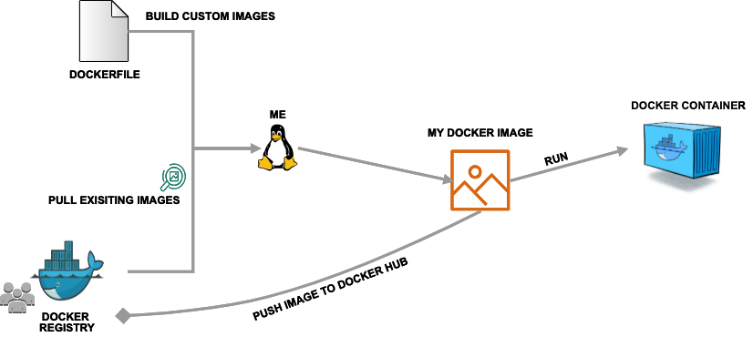

==========================
Introduction to Containers
==========================

What is a Container?
--------------------

- A container is a standard unit of software that packages up code and all its dependencies so the
  application runs quickly and reliably from one computing environment to another.

- Containers allow a developer to package up an application with all of the parts it needs,
  such as libraries and other dependencies, and ship it all out as one package.

- Multiple containers can run on the same machine and share the OS kernel with other containers,
  each running as isolated processes in user space, hence are *lightweight* and have *low overhead*.

- Containers ensure *portability* and *reproducibilty* by isolating the application from environment.

**Container vs VM**

.. figure:: images/vm_cont.png
   :height: 500
   :width: 700
   :align: center

+------------------------------------+-------------------------------------------------+
| Container                          |          VM                                     |
+====================================+=================================================+
| OS process level isolation         |  OS level isolation with virtualized hardware   |
+------------------------------------+-------------------------------------------------+
| Can run 1,000s on a single machine |  Can run “dozens” on a single machine.          |
+------------------------------------+-------------------------------------------------+
| Leverages kernel features          | Leverages hypervisors (requirements on hardware)|
| (requirements on kernel version)   |                                                 |
+------------------------------------+-------------------------------------------------+
| Start up time ~100s of ms          |  Start up time ~minutes                         |
+------------------------------------+-------------------------------------------------+

**Benefits of using containers include:**

- Platform independence: Build it once, run it anywhere
- Resource efficiency and density
- Enables reproducible science
- Effective isolation and resource sharing

Container Technologies
======================

**Docker**

Docker is a set of platform as a service products that use OS-level virtualization to deliver
software in packages called containers.

**Singularity**

Singularity is a container solution which provides the functionality of a virtual machine, without the heavyweight
implementation and performance costs of emulation and redundancy.
Software developers can now build their stack onto whatever operating system base fits their needs best, and
create distributable runtime encapsulated environments and the users never have to worry about dependencies,
requirements, or anything else from the user space.

Docker helps to develop containers and run them on our laptops.  We use Singularity as a runtime on our HPC systems.

**We can find existing containers at:**

1. `Docker Hub <https://hub.docker.com/>`_
2. `Singularity Hub <https://singularity-hub.org/>`_
3. `BioContainers <https://biocontainers.pro/#/>`_

.. figure:: images/docker_logo.jpg
   :height: 180
   :width: 200
   :align: right
   :alt: Docker Logo
   :figclass: left

Docker
======

`Docker <https://www.docker.com/>`_ is a platform for building and executing containers.

   - Docker (2013) is the gold standard container technology.
   - It can package an application and its dependencies in a virtual container that can run on any Linux server.
   - This helps provide **flexibility** and **portability** enabling the application to be run in various locations.
   - Docker grants superuser privileges and some containers may allow users root access to host files.
   - Docker-compatible technologies Singularity(Stampede2) and Shifter (Blue Waters, Cori) were designed for HPC environments.

In the Docker world ...
=======================

**Containers**

A container is a standard unit of software that packages up code and all its
dependencies so the application runs quickly and reliably from one computing environment to another. Containers includes everything from the
operating system, user-added files, metadata.

Containers are very useful as they are available for both Linux and Windows-based applications, containerized software
will run the same, irrespective of the infrastructure. They isolate the software from the environment, facilitating users to overcome
conflicts between local development environments and execution environment.

*Running an image creates a Docker Container*
They feature a read-write layer on top, are interactive and can store state. This means that once you execute inside a Docker container,
you can save a snapshot of the resulting state as another image.

**Images**

A Docker image is a read-only file used to produce Docker containers.
It is comprised of layers of other images, any change made to an image is carried out by adding a new layer.

Base Image is the layer that does not depend on any other layer. For example most of the time this layer defines the operating system
for the docker container's environment.

An image gets built by building a Dockerfile.

... which brings us to

**What is a Dockerfile?**

Dockerfiles are text files you create with the commands you would like to execute on the command line inside a container to
create a Docker image. Docker reads the commands from top to bottom and builds a Docker image from it.

Dockerfiles are useful as they contain the history of the procedure used to create an image. They can be used to install required dependencies,
tools, tool-related files into the docker container.

Some best practices for writing Dockerfiles can be found at: `Best Practices <https://docs.docker.com/develop/develop-images/dockerfile_best-practices/>`_.

The *docker build* command builds an image from a Dockerfile and a context. The build’s context is the set of files at a specified location PATH or URL.
The PATH is a directory on your local filesystem. The URL is a Git repository location.

With a Dockerfile in the current directory, we can build an image from it by

.. code-block:: bash

  $ docker build .
  Sending build context to Docker daemon  6.51 MB
  . . .

**Image Registry**

We can store the docker images we create in image registries. Registries are organized into collections of images called *repositories*.

`Docker Hub <https://hub.docker.com/>`_ is a central, public repository of images.
The docker hub contains images contributed by individual users and organizations as well as
“official images”. Explore the offcial docker images here: https://hub.docker.com/explore/

**Image Tags**

Docker supports the notion of image tags, similar to tags in a git repository. Tags identify a specific version of an image.

The full name of an image on the Docker Hub is comprised of components separated by slashes.
The components include a “repository” (which could be owned by an individual or organization),
the “name”, and the “tag”. For example, an image with the full name

.. code-block:: bash

   $ tacc/gateways19:0.1

would refer to the gateways19 image within the “tacc” repository and have a
tag of “0.1”.

TACC maintains multiple repositories on the Docker Hub including:

  - tacc
  - taccsciapps
  - tapis
  - abaco

**Docker Worflow Overview**

