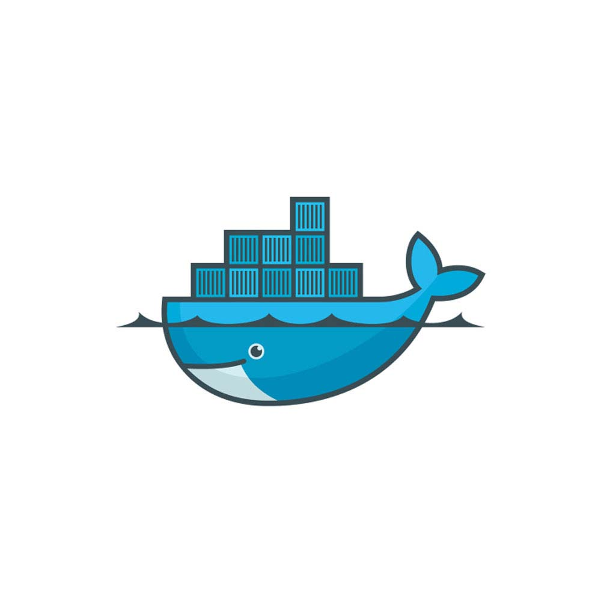
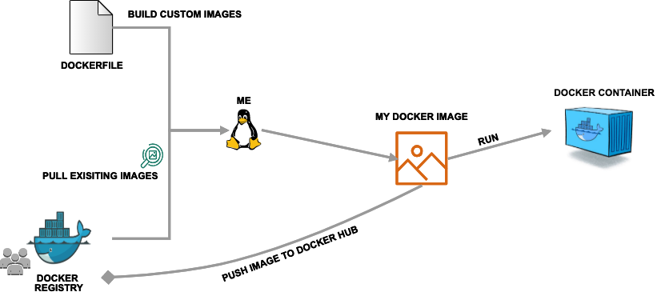

======
Docker
======

`Docker <https://www.docker.com/>`_ is a platform for building and executing containers.

- Docker (2013) is the gold standard container technology.
- It can package an application and its dependencies in a virtual container that can run on any Linux server.
- This helps provide **flexibility** and **portability** enabling the application to be run in various locations.
- Docker grants superuser privileges and some containers may allow users root access to host files.
- Docker-compatible technologies Singularity(Stampede2) and Shifter (Blue Waters, Cori) were designed for HPC environments.

In the Docker world ...
=======================

**Containers**

A container is a standard unit of software that packages up code and all its
dependencies so the application runs quickly and reliably from one computing environment to another. Containers includes everything from the
operating system, user-added files, metadata.

Containers are very useful as they are available for both Linux and Windows-based applications, containerized software
will run the same, irrespective of the infrastructure. They isolate the software from the environment, facilitating users to overcome
conflicts between local development environments and execution environment.

*Running an image creates a Docker Container*
They feature a read-write layer on top, are interactive and can store state. This means that once you execute inside a Docker container,
you can save a snapshot of the resulting state as another image.

**Images**

A Docker image is a read-only file used to produce Docker containers.
It is comprised of layers of other images, any change made to an image is carried out by adding a new layer.

Base Image is the layer that does not depend on any other layer. For example most of the time this layer defines the operating system
for the docker container's environment.

An image gets built by building a Dockerfile.

... which brings us to

**What is a Dockerfile?**

Dockerfiles are text files you create with the commands you would like to execute on the command line inside a container to
create a Docker image. Docker reads the commands from top to bottom and builds a Docker image from it.

Dockerfiles are useful as they contain the history of the procedure used to create an image. They can be used to install required dependencies,
tools, tool-related files into the docker container.

Some best practices for writing Dockerfiles can be found at: `Best Practices <https://docs.docker.com/develop/develop-images/dockerfile_best-practices/>`_.

With a Dockerfile in hand, we can build an image from it by

.. code-block:: bash

   $ docker build .

**Image Registry**

We can store the docker images we create in image registries. Registries are organized into collections of images called *repositories*.

`Docker Hub <https://hub.docker.com/>`_ is a central, public repository of images.
The docker hub contains images contributed by individual users and organizations as well as
“official images”. Explore the offcial docker images here: https://hub.docker.com/explore/

**Image Tags**

Docker supports the notion of image tags, similar to tags in a git repository. Tags identify a specific version of an image.

The full name of an image on the Docker Hub is comprised of components separated by slashes.
The components include a “repository” (which could be owned by an individual or organization),
the “name”, and the “tag”. For example, an image with the full name

.. code-block:: bash

   $ tacc/gateways19:0.1

would refer to the gateways19 image within the “tacc” repository and have a
tag of “0.1”.

TACC maintains multiple repositories on the Docker Hub including:

- tacc
- taccsciapps
- tapis
- abaco

**Docker Worflow Overview**

Getting Started With Docker
===========================

Prerequisites
-------------

* Install Docker on your laptop:

  - `Mac <https://docs.docker.com/v17.09/docker-for-mac/install>`_
  - `Windows 10 <https://docs.docker.com/v17.09/docker-for-windows/install/>`_
  - `Ubuntu <https://docs.docker.com/v17.09/engine/installation/linux/ubuntu/>`_
  - `CentOS <https://docs.docker.com/v17.09/engine/installation/linux/centos/>`_
  - `Debian <https://docs.docker.com/v17.09/engine/installation/linux/docker-ce/debian/>`_
  - `Fedora <https://docs.docker.com/v17.09/engine/installation/linux/docker-ce/fedora/>`_

To check if the installation was successful, open up your favorite Terminal (Mac,Linux) or the Docker Terminal (Windows)
and try running

.. code-block:: bash

   $ docker version
   Client: Docker Engine - Community
   Version:           19.03.5
   API version:       1.40
   Go version:        go1.12.12
   Git commit:        633a0ea
   Built:             Wed Nov 13 07:22:34 2019
   OS/Arch:           darwin/amd64
   Experimental:      false

   Server: Docker Engine - Community
   Engine:
   Version:          19.03.5
   API version:      1.40 (minimum version 1.12)
   Go version:       go1.12.12
   Git commit:       633a0ea
   Built:            Wed Nov 13 07:29:19 2019
   OS/Arch:          linux/amd64
   Experimental:     false
   containerd:
   Version:          v1.2.10
   GitCommit:        b34a5c8af56e510852c35414db4c1f4fa6172339
   runc:
   Version:          1.0.0-rc8+dev
   GitCommit:        3e425f80a8c931f88e6d94a8c831b9d5aa481657
   docker-init:
   Version:          0.18.0
   GitCommit:        fec3683

This also ensures you can access the docker daemon.

* Create a `Docker Hub account <https://hub.docker.com/signup/>`_

Having a Docker Hub account makes it easier to share your containers with other researchers.

Let's login into Docker Hub to be able to push images to your repository.

.. code-block:: bash

   $ docker login
   # Enter username/password

* Create a `TACC Account <https://portal.tacc.utexas.edu/account-request>`_

Working with Docker Hub images
==============================

* Say *hello* from Docker

Let's run a simple hello-world container using the * docker run * command

.. code-block:: bash

   $ docker run hello-world
   Unable to find image 'hello-world:latest' locally
   latest: Pulling from library/hello-world
   1b930d010525: Pull complete
   Digest: sha256:5f179596a7335398b805f036f7e8561b6f0e32cd30a32f5e19d17a3cda6cc33d
   Status: Downloaded newer image for hello-world:latest

   Hello from Docker!
   This message shows that your installation appears to be working correctly.

   To generate this message, Docker took the following steps:
   1. The Docker client contacted the Docker daemon.
   2. The Docker daemon pulled the "hello-world" image from the Docker Hub.
    (amd64)
    3. The Docker daemon created a new container from that image which runs the
    executable that produces the output you are currently reading.
    4. The Docker daemon streamed that output to the Docker client, which sent it
    to your terminal.

This simple command pulls the hello-world image from Docker Hub and prints the message.

* To pull an image off Docker Hub use the *docker pull* command

Let's make this easier by first pulling the image from Docker Hub

.. code-block:: bash

   $ docker pull hello-world:latest
   latest: Pulling from library/hello-world
   1b930d010525: Pull complete
   Digest: sha256:4df8ca8a7e309c256d60d7971ea14c27672fc0d10c5f303856d7bc48f8cc17ff
   Status: Downloaded newer image for hello-world:latest
   docker.io/library/hello-world:latest

* To verify the images are now available on your local machine, try:

.. code-block:: bash

   $ docker images
   REPOSITORY               TAG                 IMAGE ID            CREATED             SIZE
   hello-world              latest              fce289e99eb9        11 months ago       1.84kB

* Now run the container:

.. code-block:: bash

   $ docker run hello-world:latest
   Hello from Docker!
   This message shows that your installation appears to be working correctly.

Another simple example:

.. code-block:: bash

   $ docker pull python
   Using default tag: latest
   latest: Pulling from library/python
   . . .

Note: As indicated in the output, if no tag is specified the “latest” tag is pulled.

You could also try:

.. code-block:: bash

   $ docker inspect hello-world
   # shows more information about container image

Docker Core Commands
====================

+----------------+------------------------------------------------------+
| Command        |          Usage                                       |
+================+======================================================+
| docker login   |  Authenticate to Docker Hub or other Docker Registry |
|                |  using username and password                         |
+----------------+------------------------------------------------------+
| docker run     |  *Usage: docker run -it user/imagetag*               |
+----------------+------------------------------------------------------+
| docker build   |  *Usage: docker build -t username/imagetag .*        |
|                |  Build a docker image from a Dockerfile in the       |
|                |  current working directory. -t to tag the image      |
+----------------+------------------------------------------------------+
| docker images  |  List all images on the local machine                |
+----------------+------------------------------------------------------+
| docker tag     |  Add a new tag to an image                           |
+----------------+------------------------------------------------------+
| docker pull    |  Download an image from Docker Hub                   |
+----------------+------------------------------------------------------+
| docker push    |  *Usage: docker push username/imagetag*              |
|                |  Upload an image to Docker Hub                       |
+----------------+------------------------------------------------------+
| docker inspect |  *Usage: docker inspect containerID*                 |
|                |  Provide detailed information on constructs          |
|                |  controlled by Docker                                |
+----------------+------------------------------------------------------+
| docker ps -a   |  List all containers on your system                  |
+----------------+------------------------------------------------------+
| docker rmi     |  Delete an image                                     |
+----------------+------------------------------------------------------+
| docker rm      |  *Usage: docker rm -f [container name or ID]*        |
|                |  Delete a container                                  |
|                |  -f optional to remove running container             |
+----------------+------------------------------------------------------+
| docker stop    |  *Usage*: docker stop [container name or ID]*        |
|                |  Stop a container                                    |
+----------------+------------------------------------------------------+

Getting more help with Docker
=============================

- The command line tools are very well documented:

.. code-block:: bash

   $ docker --help
   # shows all docker options and summaries

.. code-block:: bash

   $ docker COMMAND --help
   # shows options and summaries for a particular command

- Learn `more about docker <https://docs.docker.com/get-started/>`_
