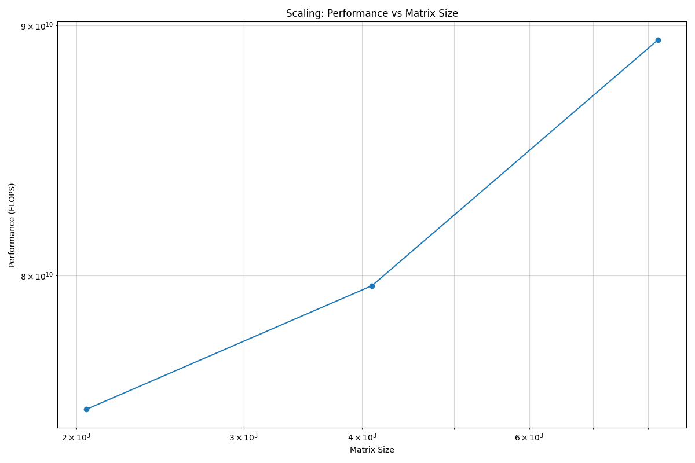
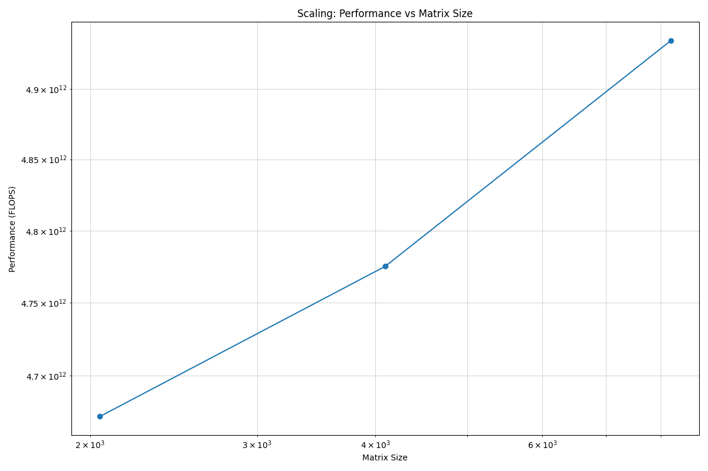
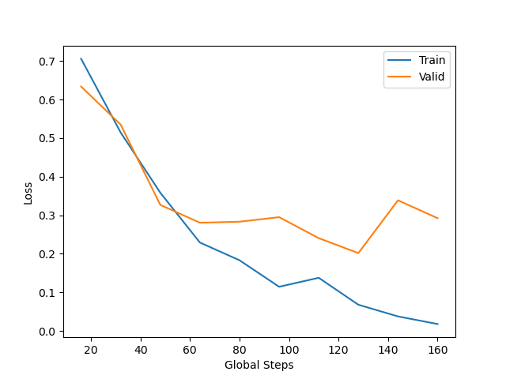
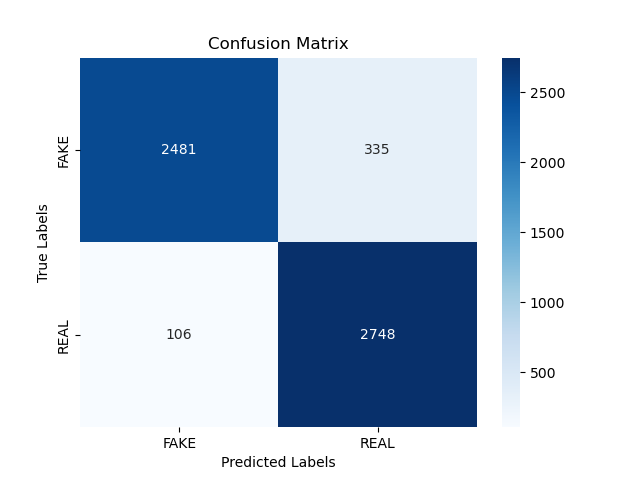

**********************
MPI and GPU Containers
**********************

Message Passing Interface (MPI) for running on multiple nodes
=============================================================

Distributed MPI execution of containers is supported by Apptainer.

Since (by default) the network is the same inside and outside the container, the communication between containers usually just works.  The more complicated bit is making sure that the container has the right set of MPI libraries to interact with high-speed fabrics.  MPI is an open specification, but there are several implementations (OpenMPI, MVAPICH2, and Intel MPI to name three) with some non-overlapping feature sets.  There are also different hardware implementations (e.g. Infiniband, Intel Omnipath, Cray Aries) that need to match what is inside the container.  If the host and container are running different MPI implementations, or even different versions of the same implementation, MPI may not work.

The general rule is that you want the version of MPI inside the container to be the same version or newer than the host.  You may be thinking that this is not good for the portability of your container, and you are right.  Containerizing MPI applications is not terribly difficult with Apptainer, but it comes at the cost of additional requirements for the host system.

.. Warning::

  Many HPC Systems, like Frontera, have high-speed, low latency networks that have special drivers.  Infiniband, Aries, and OmniPath are three different specs for these types of networks.  When running MPI jobs, if the container doesn't have the right libraries, it won't be able to use those special interconnects to communicate between nodes.  This means that MPI containers don't provide as much portability between systems.

Base Docker images
------------------

When running at TACC, we have a set of curated Docker images for use in the FROM line of your own containers.  You can see a list of available images at `https://github.com/TACC/tacc-containers <https://github.com/TACC/tacc-containers>`_.

+---------------------------------------+----------------------+----------------------+----------------------+
| Image                                 | Frontera             | Lonestar6            | Local Dev            |
+=======================================+======================+======================+======================+
| tacc/tacc-centos7-mvapich2.3-ib       | |:heavy_check_mark:| | |:heavy_check_mark:| | |:heavy_check_mark:| |
+---------------------------------------+----------------------+----------------------+----------------------+
| tacc/tacc-centos7-impi19.0.7-common   | |:heavy_check_mark:| | |:heavy_check_mark:| | |:heavy_check_mark:| |
+---------------------------------------+----------------------+----------------------+----------------------+
| tacc/tacc-ubuntu18-mvapich2.3-ib      | |:heavy_check_mark:| | |:heavy_check_mark:| | |:heavy_check_mark:| |
+---------------------------------------+----------------------+----------------------+----------------------+
| tacc/tacc-ubuntu18-impi19.0.7-common  | |:heavy_check_mark:| | |:heavy_check_mark:| | |:heavy_check_mark:| |
+---------------------------------------+----------------------+----------------------+----------------------+

.. Note::

   The apptainer version of these containers should be invoked with ``apptainer run`` on HPC.

In this tutorial, we will be using use the ``tacc/tacc-ubuntu18-impi19.0.7-common`` image to satisfy the MPI architecture on Frontera, while also allowing intra-node (single-node, multiple-core) testing on your local development system.

Building a MPI aware container
------------------------------

On your local laptop, go back to the directory where you built the "pi" Docker image and download (or copy and paste) two additional files:

* `Dockerfile.mpi <https://raw.githubusercontent.com/TACC/containers_at_tacc/master/docs/scripts/Dockerfile.mpi>`_
* `pi-mpi.py <https://raw.githubusercontent.com/TACC/containers_at_tacc/master/docs/scripts/pi-mpi.py>`_

Take a look at both files.  ``pi-mpi.py`` is an updated Python script that uses MPI for parallelization.  ``Dockerfile.mpi`` is an updated Dockerfile that uses the TACC base image to satisfy all the MPI requirements on Frontera.

.. note::

	A full MPI stack with ``mpicc`` is available in these containers, so you can compile code too.

With these files downloaded, we can build a new MPI-capable container for faster execution.

.. code-block:: console

	$ docker build -t USERNAME/pi-estimator:0.1-mpi -f Dockerfile.mpi .

.. Note::

	Don't forget to change USERNAME to your DockerHub username!

To prevent this build from overwriting our previous container (``USERNAME/pi-estimator:0.1``), the "tag" was changed from ``0.1`` to ``0.1-mpi``.  We also could have just renamed the "repository" to something like ``USERNAME/pi-estimator-mpi:0.1``.  You will see both conventions used on DockerHub.  For different versions, or maybe architectures, of the same codebase, it is okay to differentiate them by tag.  Independent codes should use different repository names.

Once you have successfully built the image, push it up to DockerHub with the ``docker push`` command so that we can pull it back down on Frontera.

.. code-block:: console

   $ docker push USERNAME/pi-estimator:0.1-mpi

Running an MPI Container Locally
--------------------------------

Before using allocation hours at TACC, it's always a good idea to test your code locally. Since your local workstation may not have as many resources as a TACC compute node, testing is often done with a *toy* sized problem to check for correctness.

Our ``pi-estimator:0.1-mpi`` container started FROM ``tacc/tacc-ubuntu18-impi19.0.7-common``, which is capable of locally testing the MPI capabilities using shared memory. Launch the ``pi-mpi.py`` script with ``mpirun`` from inside the container. By default, ``mpirun`` will launch as many processes as cores, but this can be controlled with the ``-n`` argument.

Lets try computing Pi with 10,000,000 samples using 1 and 2 processors.

.. code-block:: console

	Run using 1 processor
	$ docker run --rm USERNAME/pi-estimator:0.1-mpi mpirun -n 1 pi-mpi.py 10000000

	Run using 2 processors
	$ docker run --rm USERNAME/pi-estimator:0.1-mpi mpirun -n 2 pi-mpi.py 10000000

You should notice that while the estimate stayed roughly the same, the execution time halved as the program scaled from one to two processors.

.. Note::

	If the computation time did not decrease, your Docker Desktop may not be `configured <https://docs.docker.com/docker-for-mac/>`_ to use multiple cores.

Now that we validated the container locally, we can take it to a TACC node and scale it up further.

Running an MPI Container on Frontera
------------------------------------

To start, lets allocate a single `GPU Node <https://frontera-portal.tacc.utexas.edu/user-guide/system/#gpu-nodes>`_, which has 16 physical Intel cores and 4 NVIDIA Quadro RTX 5000 GPUs per node. But, lets only use 8 cores to make the log messages a little more legible.

Running interactively
+++++++++++++++++++++

Please use ``idev`` to allocate this 8-task compute node.

.. code-block:: console

	$ idev -m 60 -p rtx -N 1 -n 8

Once you have your node, pull the container and run it as follows:

.. code-block:: console

	Load apptainer module
	$ module load tacc-apptainer

	Change to $SCRATCH directory so containers do not go over your $HOME quota
	$ cd $SCRATCH

	Pull container
	$ apptainer pull docker://USERNAME/pi-estimator:0.1-mpi

	Run container sequentially
	$ ibrun -n 1 apptainer run pi-estimator_0.1-mpi.sif pi-mpi.py 10000000

	Run container distributed
	$ ibrun apptainer run pi-estimator_0.1-mpi.sif pi-mpi.py 10000000

	Run container with fewer tasks
	$ ibrun -n 4 apptainer run pi-estimator_0.1-mpi.sif pi-mpi.py 10000000

In our local tests, the **container** ``mpirun`` program was used to launch multiple processes, but this does not scale to multiple nodes. When using multiple nodes at TACC, you should always use ``ibrun`` to call apptainer to launch a container per process across each **host**.

.. Note::

	The ``*impi*`` containers **must** be launched with ``apptainer run`` on HPC systems. Also, you
	might need to set ``FI_PROVIDER=tcp`` temporarily when running on rtx nodes.

	TACC uses a command called ``ibrun`` on all of its systems that configures MPI to use the high-speed, low-latency network, and binds processes to specific cores.  If you are familiar with MPI, this is the functional equivalent to ``mpirun``.

Take some time and try running the program with more samples. Just remember that each extra digit will increase the runtime by about 10-times the previous, so hit ``Ctrl-C`` to terminate something that's taking too long.

Running via batch submission
++++++++++++++++++++++++++++

To run a container via non-interactive batch job, the container should first be downloaded to a performant filesystem like ``$SCRATCH`` or ``$HOME``.

.. code-block:: console

	$ idev -m 60 -p rtx -N 1
	$ cd $SCRATCH
	$ module load tacc-apptainer
	$ apptainer pull docker://USERNAME/pi-estimator:0.1-mpi
	$ ls *sif
	$ exit

After pulling the container, the image file can be referred to in an sbatch script. Please create ``pi-mpi.sbatch`` with the following text:

.. code-block:: bash

	#!/bin/bash

	#SBATCH -J calculate-pi-mpi                  # Job name
	#SBATCH -o calculate-pi-mpi.%j               # Name of stdout output file (%j expands to jobId)
	#SBATCH -p rtx                               # Queue name
	#SBATCH -N 1                                 # Total number of nodes requested (56 cores/node)
	#SBATCH -n 8                                 # Total number of mpi tasks requested
	#SBATCH -t 00:10:00                          # Run time (hh:mm:ss)
	#SBATCH --reservation Containers-Fall24      # a reservation only active during the training

	module load tacc-apptainer
	cd $SCRATCH
	ibrun apptainer run pi-estimator_0.1-mpi.sif pi-mpi.py 10000000

Then, you can submit the job with ``sbatch``

.. code-block:: console

	$ sbatch pi-mpi.sbatch

Check the status of your job with ``squeue``

.. code-block:: console

	$ squeue -u USERNAME

When your job is done, the output will be in ``calculate-pi-mpi.[job number]``, and can be viewed with ``cat``, ``less``, or your favorite text editor.

Once done, try scaling up the program to two nodes (``-N 2``) and 16 tasks (``-n 16``) by changing your batch script or idev session. After that, try increasing the number of samples to see how accurate your estimate can get.

.. Note::

	If your batch job is running too long, you can finding the job number with `squeue -u [username]` and then terminate it with ``scancel [job number]``

Apptainer and GPU Computing
=============================

Apptainer **fully** supports GPU utilization by exposing devices at runtime with the ``--nv`` flag. This is similar to ``nvidia-docker``, so all docker containers with libraries that are compatible with the drivers on our systems can work as expected.

Base Docker images
------------------

When running at TACC, we have a set of curated Docker images that include `TensorFlow <https://www.tensorflow.org/>`_ and `PyTorch <https://pytorch.org/>`_ for use in the FROM line of your own containers.  You can see a list of available images at `Docker Hub <https://hub.docker.com/r/tacc/tacc-ml>`_ and the source at `https://github.com/TACC/tacc-ml <https://github.com/TACC/tacc-ml>`_.

+------------------------------------------------------+----------------------+----------------------+
| Image                                                | Frontera/rtx         | Lonestar6            |
+======================================================+======================+======================+
| tacc/tacc-ml:centos7-cuda10-tf1.15-pt1.3             | |:heavy_check_mark:| |                      |
+------------------------------------------------------+----------------------+----------------------+
| tacc/tacc-ml:centos7-cuda10-tf2.4-pt1.7              | |:heavy_check_mark:| |                      |
+------------------------------------------------------+----------------------+----------------------+
| tacc/tacc-ml:centos7-cuda11-tf2.6-pt1.10             | |:heavy_check_mark:| | |:heavy_check_mark:| |
+------------------------------------------------------+----------------------+----------------------+
| tacc/tacc-ml:ubuntu16.04-cuda10-tf1.15-pt1.3         | |:heavy_check_mark:| |                      |
+------------------------------------------------------+----------------------+----------------------+
| tacc/tacc-ml:ubuntu16.04-cuda10-tf2.4-pt1.7          | |:heavy_check_mark:| |                      |
+------------------------------------------------------+----------------------+----------------------+
| tacc/tacc-ml:ubuntu20.04-cuda11-tf2.6-pt1.10         | |:heavy_check_mark:| | |:heavy_check_mark:| |
+------------------------------------------------------+----------------------+----------------------+

For instance, the latest version of caffe can be used on TACC systems as follows:

.. code-block:: console

  Work from a compute node
  $ idev -m 60 -p rtx

  Load the apptainer module
  $ module load tacc-apptainer

  Pull your image
  $ apptainer pull docker://nvidia/caffe:latest

  Test the GPU
  $ apptainer exec --nv caffe_latest.sif caffe device_query -gpu 0

.. Note::

	If this resulted in an error and the GPU was not detected, and you are on a GPU-enabled compute node, you may have excluded the ``--nv`` flag.

As previously mentioned, the main requirement for GPU-enabled containers to work is that the version of the NVIDIA host driver on the system supports the version of the CUDA library inside the container.

For some more exciting examples, lets look at two of the most popular Deep Learning frameworks for Python, `Tensorflow <https://www.tensorflow.org/>`_ and `PyTorch <https://pytorch.org/>`_.

First, we'll run a simple script (`tf_test.py <https://raw.githubusercontent.com/TACC/containers_at_tacc/master/docs/scripts/tf_test.py>`_) that uses Tensorflow to show the GPUs and then creates two tensors and multiplies them together. It can be tested as follows:

.. code-block:: console

  Change to your $SCRATCH directory
  $ cd $SCRATCH

  Download the test code
  $ wget https://raw.githubusercontent.com/TACC/containers_at_tacc/master/docs/scripts/tf_test.py

  Pull the image
  $ apptainer pull docker://tensorflow/tensorflow:latest-gpu

  Run the code
  $ apptainer exec --nv tensorflow_latest-gpu.sif python tf_test.py 2>warnings.txt
  Tensorflow version: 2.17.0
  GPU available: True

  GPUs:
  Name: /physical_device:GPU:0   Type: GPU
  Name: /physical_device:GPU:1   Type: GPU
  Name: /physical_device:GPU:2   Type: GPU
  Name: /physical_device:GPU:3   Type: GPU

  TNA= tf.Tensor(
  [[1. 2. 3.]
  [4. 5. 6.]], shape=(2, 3), dtype=float32)
  TNB= tf.Tensor(
  [[1. 2.]
  [3. 4.]
  [5. 6.]], shape=(3, 2), dtype=float32)
  TNAxTNB= tf.Tensor(
  [[22. 28.]
  [49. 64.]], shape=(2, 2), dtype=float32)

.. Note::

	If you would like avoid the wordy tensorflow warning messages, run the above command and
	redirect STDERR to a file (i.e. ``2>warnings.txt``).

Next, we'll look at another example of matrix multiplication using PyTorch (`pytorch_matmul_scaling_test.py <https://raw.githubusercontent.com/TACC/containers_at_tacc/master/docs/scripts/pytorch_matmul_scaling_test.py>`_) where we'll show how long it takes to multiply increasingly bigger matrices using both the CPU and GPU.
It can be tested as follows:

.. code-block:: console

  Change to your $SCRATCH directory
  $ cd $SCRATCH

  Download the test code
  $ wget https://raw.githubusercontent.com/TACC/containers_at_tacc/master/docs/scripts/pytorch_matmul_scaling_test.py

  Pull the image
  $ apptainer pull docker://eriksf/pytorch:2.4.1-cuda12.1-cudnn9-runtime

  Run the code against the CPU
  $ apptainer exec --nv pytorch_2.4.1-cuda12.1-cudnn9-runtime.sif python pytorch_matmul_scaling_test.py --no-gpu
  INFO:    gocryptfs not found, will not be able to use gocryptfs
  PyTorch Matrix Multiplication Test for Large Matrices
  PyTorch version: 2.4.1+cu121
  Using device: cpu

  Running test for matrix size: 2048x2048
  Estimated memory requirement: 0.03 GB

  Running test for matrix size: 4096x4096
  Estimated memory requirement: 0.12 GB

  Running test for matrix size: 8192x8192
  Estimated memory requirement: 0.50 GB
                   Matrix Multiplication Test Results
  ┏━━━━━━━━━━━━━┳━━━━━━━━━━━━━━━━━━┳━━━━━━━━━━━━━━━━━━━━━━┳━━━━━━━━━━━━━━┓
  ┃ Matrix Size ┃ Memory Size (GB) ┃ Computation Time (s) ┃ Performance  ┃
  ┡━━━━━━━━━━━━━╇━━━━━━━━━━━━━━━━━━╇━━━━━━━━━━━━━━━━━━━━━━╇━━━━━━━━━━━━━━┩
  │ 2048x2048   │ 0.03             │ 0.1995               │ 86.13 GFLOPS │
  │ 4096x4096   │ 0.12             │ 1.5595               │ 88.13 GFLOPS │
  │ 8192x8192   │ 0.50             │ 12.4375              │ 88.40 GFLOPS │
  └─────────────┴──────────────────┴──────────────────────┴──────────────┘
  Scaling plot saved as 'scaling_plot.png'

The script also produces a scaling plot:

  Scaling plot for CPU

.. code-block:: console

  Run the code against the GPU
  $ apptainer exec --nv pytorch_2.4.1-cuda12.1-cudnn9-runtime.sif python pytorch_matmul_scaling_test.py
  INFO:    gocryptfs not found, will not be able to use gocryptfs
  PyTorch Matrix Multiplication Test for Large Matrices
  PyTorch version: 2.4.1+cu121
  Using device: cuda
  CUDA version: 12.1
  GPU: Quadro RTX 5000
  GPU Memory: 15.74 GB

  Running test for matrix size: 2048x2048
  Estimated memory requirement: 0.03 GB

  Running test for matrix size: 4096x4096
  Estimated memory requirement: 0.12 GB

  Running test for matrix size: 8192x8192
  Estimated memory requirement: 0.50 GB
                  Matrix Multiplication Test Results
  ┏━━━━━━━━━━━━━┳━━━━━━━━━━━━━━━━━━┳━━━━━━━━━━━━━━━━━━━━━━┳━━━━━━━━━━━━━┓
  ┃ Matrix Size ┃ Memory Size (GB) ┃ Computation Time (s) ┃ Performance ┃
  ┡━━━━━━━━━━━━━╇━━━━━━━━━━━━━━━━━━╇━━━━━━━━━━━━━━━━━━━━━━╇━━━━━━━━━━━━━┩
  │ 2048x2048   │ 0.03             │ 0.0037               │ 4.67 TFLOPS │
  │ 4096x4096   │ 0.12             │ 0.0288               │ 4.78 TFLOPS │
  │ 8192x8192   │ 0.50             │ 0.2252               │ 4.88 TFLOPS │
  └─────────────┴──────────────────┴──────────────────────┴─────────────┘
  Scaling plot saved as 'scaling_plot.png'

The script also produces a scaling plot:

  Scaling plot for GPU

Building a GPU aware container
------------------------------

In the previous couple of examples, we have used pre-built containers to test GPU capability. Here we are going to build a GPU aware container
to do some NLP/Text classification with the `BERT <https://arxiv.org/abs/1810.04805>`_ transformer model using PyTorch. We are going to
use one of the TACC base images (tacc/tacc-ml:centos7-cuda10-tf2.4-pt1.7) as a starting point.

On your local laptop, create a directory to build the "bert-classifier" Docker image and download (or copy and paste) the following files:

* `Dockerfile <https://raw.githubusercontent.com/eriksf/bert-classifier/main/Dockerfile>`_
* `bert_classifier.py <https://raw.githubusercontent.com/eriksf/bert-classifier/main/bert_classifier.py>`_
* `train.csv <https://github.com/eriksf/bert-classifier/raw/main/train.csv>`_
* `test.csv <https://github.com/eriksf/bert-classifier/raw/main/test.csv>`_
* `valid.csv <https://raw.githubusercontent.com/eriksf/bert-classifier/main/valid.csv>`_

.. Note::

    For speed, you can also clone the repository from `https://github.com/eriksf/bert-classifier.git <https://github.com/eriksf/bert-classifier.git>`_.

Take a look at the files. ``bert_classifier.py`` is a Python script that uses PyTorch to do the text classification. The ``Dockerfile`` is
based on the **tacc/tacc-ml:centos7-cuda10-tf2.4-pt1.7** base image and installs a couple of needed python libraries in addition to moving the
datasets into the image. ``train.csv``, ``test.csv``, and ``valid.csv`` are pre-processed CSV files containing the training, test, and
validation datasets.

With these files downloaded, we can now build the image.

.. code-block:: console

	$ docker build -t USERNAME/bert-classifier:0.0.1 .

.. Note::

	Don't forget to change USERNAME to your DockerHub username!

Once you have successfully built the image, push it up to DockerHub with the ``docker push`` command so that we can pull it back down on Frontera.

.. code-block:: console

   $ docker push USERNAME/bert-classifier:0.0.1

Testing the Container Locally with CPU
--------------------------------------

As was mentioned above, before using TACC allocation hours, it's a good idea to test locally. In this case, we can at least
test that the program help works.

.. code-block:: console

   $ docker run --rm eriksf/bert-classifier:0.0.1 bert_classifier.py -h
   usage: bert_classifier.py [-h] [-d DEVICE] [-o OUTPUT] [-s SOURCE]

   optional arguments:
     -h, --help            show this help message and exit
     -d DEVICE, --device DEVICE
                           The device to run on: cpu or cuda (DEFAULT: cuda)
     -o OUTPUT, --output OUTPUT
                           The output folder (DEFAULT: current directory)
     -s SOURCE, --source SOURCE
                           The location of the data files (DEFAULT: /code in
                           container)

We could even test the classification (very slowly) using the CPU.

.. code-block:: console

   $ docker run --rm -it eriksf/bert-classifier:0.0.1 bert_classifier.py -d cpu

Running the Container on Frontera
---------------------------------

To start, lets allocate a single `RTX node <https://frontera-portal.tacc.utexas.edu/user-guide/system/#gpu-nodes>`_, which has 4 NVIDIA Quadro RTX 5000 GPUs with 16 GB of Memory each.

.. code-block:: console

	$ idev -m 60 -p rtx

Once you have your node, pull the container and run it as follows:

.. code-block:: console

  Load apptainer module
  $ module load tacc-apptainer

  Change to $SCRATCH directory
  $ cd $SCRATCH

  Pull container
  $ apptainer pull docker://USERNAME/bert-classifier:0.0.1

  Run container
  $ apptainer exec --nv bert-classifier_0.0.1.sif bert_classifier.py
  Building tokenizer from 'bert-base-uncased'
  Creating tabular datasets
  Building iterators
  Creating BERT model
  Start Training...
  Epoch [1/5], Step [16/160], Train Loss: 0.7057, Valid Loss: 0.6338
  Model saved to ==> ./model.pt
  Model saved to ==> ./metrics.pt
  Epoch [1/5], Step [32/160], Train Loss: 0.5145, Valid Loss: 0.5349
  Model saved to ==> ./model.pt
  Model saved to ==> ./metrics.pt
  Epoch [2/5], Step [48/160], Train Loss: 0.3584, Valid Loss: 0.3270
  Model saved to ==> ./model.pt
  Model saved to ==> ./metrics.pt
  Epoch [2/5], Step [64/160], Train Loss: 0.2293, Valid Loss: 0.2806
  Model saved to ==> ./model.pt
  Model saved to ==> ./metrics.pt
  Epoch [3/5], Step [80/160], Train Loss: 0.1833, Valid Loss: 0.2833
  Epoch [3/5], Step [96/160], Train Loss: 0.1146, Valid Loss: 0.2951
  Epoch [4/5], Step [112/160], Train Loss: 0.1379, Valid Loss: 0.2406
  Model saved to ==> ./model.pt
  Model saved to ==> ./metrics.pt
  Epoch [4/5], Step [128/160], Train Loss: 0.0681, Valid Loss: 0.2019
  Model saved to ==> ./model.pt
  Model saved to ==> ./metrics.pt
  Epoch [5/5], Step [144/160], Train Loss: 0.0378, Valid Loss: 0.3387
  Epoch [5/5], Step [160/160], Train Loss: 0.0180, Valid Loss: 0.2925
  Model saved to ==> ./metrics.pt
  Finished Training!
  Model loaded from <== ./metrics.pt
  Plot of loss vs. global steps saved as loss_v_global_steps.png
  Evaluating the model
  Model loaded from <== ./model.pt
  Classification Report:
                precision    recall  f1-score   support

             1     0.9590    0.8810    0.9184      2816
             0     0.8913    0.9629    0.9257      2854

      accuracy                         0.9222      5670
     macro avg     0.9252    0.9219    0.9220      5670
  weighted avg     0.9250    0.9222    0.9221      5670

  Confusion matrix saved as confusion_matrix.png

The classifier script also produces a plot of the loss vs. global steps

  Loss vs. Global Steps

and a confusion matrix

  Confusion Matrix
